# Guia de operações PCP
---
# 1. Egis
>
>
>Nosso sistema para construção das árvores dos pedido e emissão de requisições.
>
>**Usuário:** Guilherme
>**Senha:** gro0924

## 1.1 Vendas
Assim que o comercial encaminha um pedido por e-mail, deve ser cadastrado no módulo de ***Vendas internas*** no EGIS para dar continuidade às operações:

### 1.1.1 Tipos de pedido
Existem 3 tipos de pedidos:

#### 1.1.1.1 Pedidos de fabricação:

#### 1.1.1.2 Pedidos de sobressalentes:
Pedidos que contém peças de itens que compõe os equipamentos.

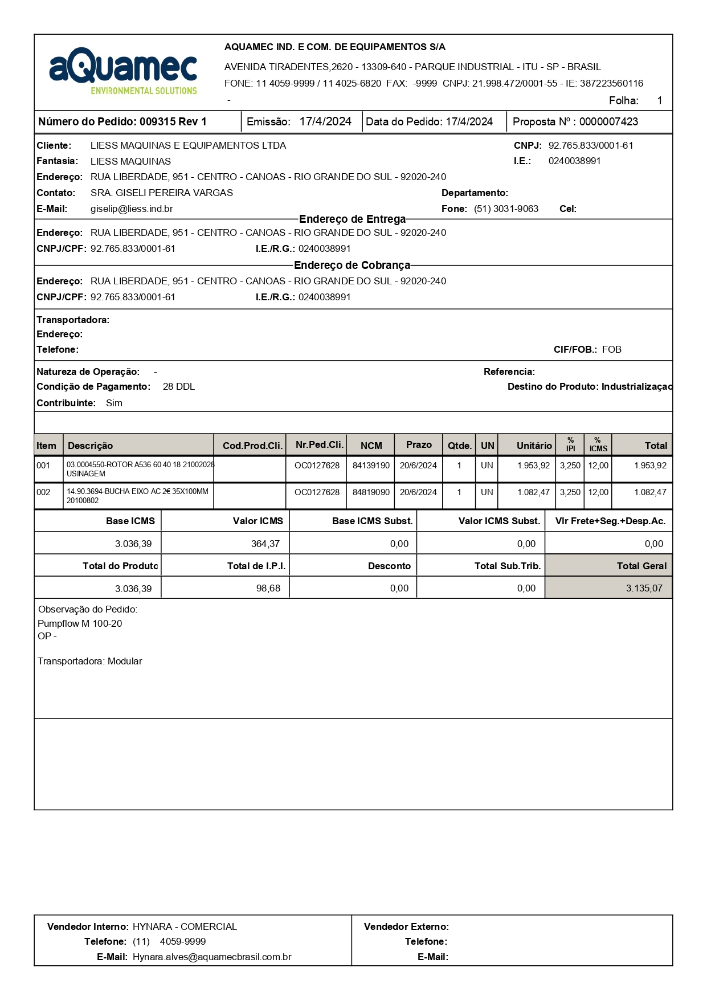

#### 1.1.1.3 Pedidos de reforma:

### 1.1.2 Inserindo um pedido
>Acesse o módulo de vendas
>
>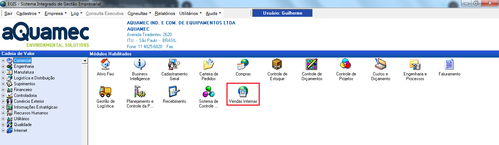

>Selecione a operação desejada no menu lateral:
>
>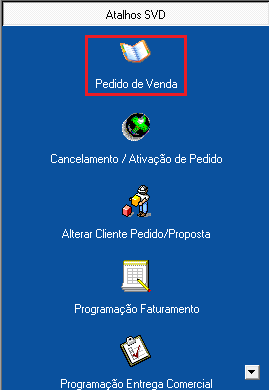

>Assim que abrir o menu de pedidos clique em *Cliente* para inserir um novo pedido. 
>
>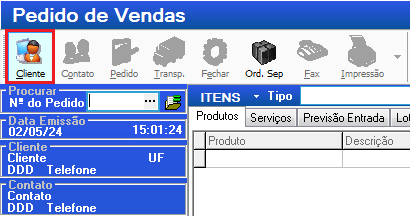

>[!NOTE]
>Os Nº de pedido são gerados automaticamente em sequência, não é possível escolher eles. Se você estiver precisando cadastrar um pedido com um Nº que não é o maior imediato ao último cadastrado será necessário cadastrar pedidos com cliente e produto genérico para preencher o gap.
> As vezes o EGIS pula um número de pedido. É uma falha sistêmica, quando isso acontecer não tem nada que possamos fazer. Continue cadastrando a partir do número que pulou.

>Na próxima tela clique em CNPJ para procurar o cliente e selecione o que mais parecer com o cliente do pedido.
>
>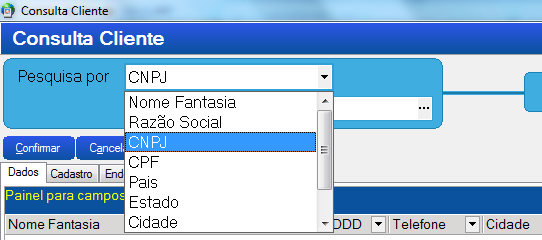

>Se não tiver o cliente cadastrado clique em *inserir* no canto inferior esquerdo e preencha os dados do cliente no próximo formulário. Os campos mais importantes são os destacados em vermelho.
>
>
>
>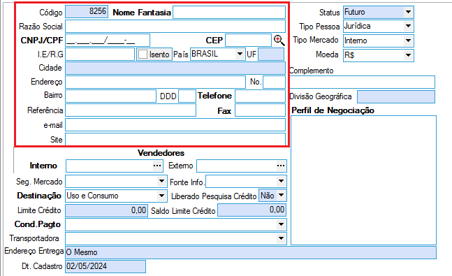

>Feito isso, um novo Nº de PV será gerado e voce poderá inserir os itens do pedido.
>
>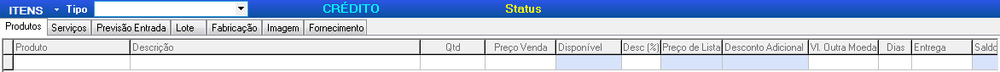

>No final clique me gravar e saia do módulo!
>
>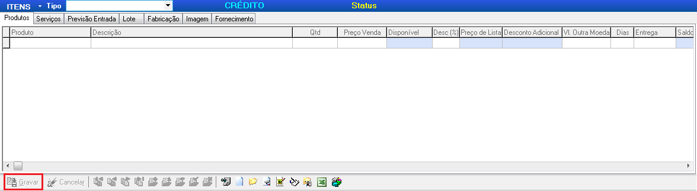

### 1.1.3 Alterando um pedido
>Para alterar um pedido é só acessá-lo através de menu de pesquisa e alterar seus dados.
>
>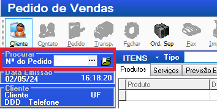

>Para alterar o cliente de um pedido será necessário acessar um menu diferente. Feche o módulo *Pedido de vendas* permanecendo apenas no módulo de *Vendas Internas* e selecione o módulo de alteração de cliente no menu esquerdo.
>
>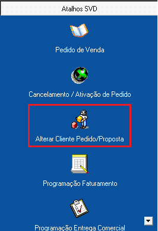

>Na próxima tela selecione o tipo *Pedido de Venda* insira o número e em *Cliente* clique nos 3 pontos para selecionar o cliente e siga os passos de cadastro de cliente explicados anteriormente no item 1.1.1
>
>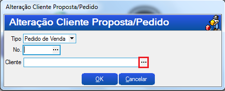

## 1.2 Engenharia

Todos os pedidos precisam ser engenheirados (ter desenho e lista de materiais) exceto itens padrões da lamor, tais como os abaixo:

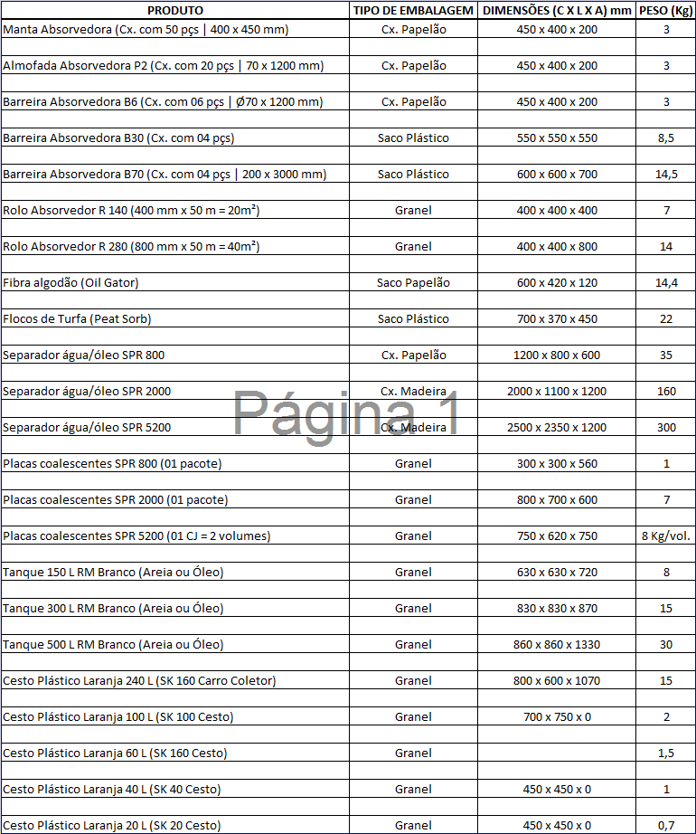

Mas, **engenheirados ou não**, todos os itens precisam ter uma árvore no EGIS onde será feito requisição interna para retirá-los do estoque, ou de compra. Essa árvore deve ser aberta no módulo de engenharia após ter recebido os documentos da engeharia.

>Módulo de engenharia:
>
> 
>
>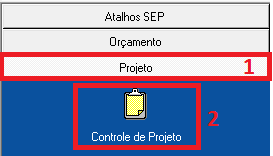

### 1.2.1 Explicando a interface

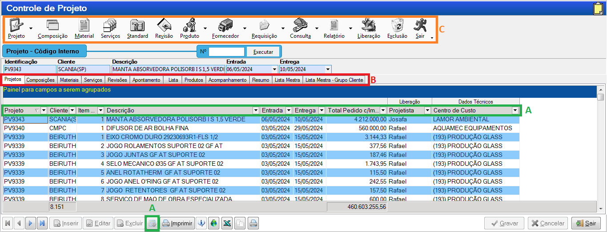

### 1.2.2 A-Colunas
Ao arrastar as colunas para cima ou para baixo você pode remover elas, ao clicar no botão  no menu inferior um menu lateral é aberto para você poder selecionar quais colunas quer ver.

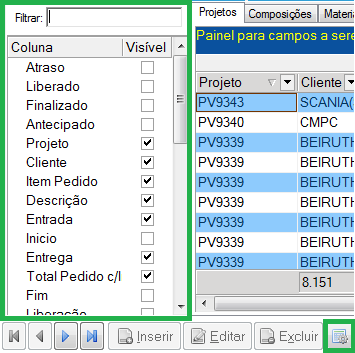

### 1.2.3 A-Projetos
Na aba de projetos é possível ver os pedidos. Para cadastrar um pedido você deve inicar um projeto conforme o tópico G.

#### 1.2.3.1 C-Cadastrar Projeto
Para cadastrar um projeto, você deve cadastrá-lo utilizando o menu 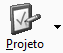. Os campos necessários para cadastrá-lo e o formato padrão para cadastro é:

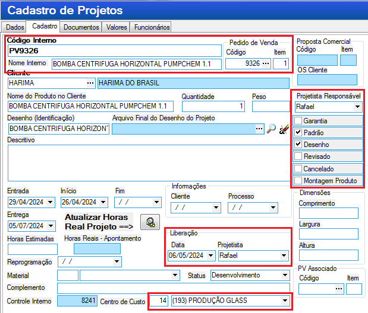

>Assim que o inserir o ***item*** do ***pedido de venda*** e pressionar *tab* os dados do cliente e o ***Nome do produto do cliente*** serão preenchidos automaticamente com as informações cadastradas no módulo de vendas,conforme visto no tópico [1.1.1 Inserindo um pedido]. Copie o ***Nome do produto do cliente*** e cole no ***Nome interno*** e no desenho insira o código do item, também pode ser o nome do produto.

>Em ***Projetista responsável*** e ***liberação*** a única mudança que haverá da imagem é o nome do projetista que deverá ser *Josafá* para os itens da *Lamor* e *Rafael* para os demais.

>O ***Centro de Custo*** no rodapé também deve ser *14 - (193) Produção Glass* para itens de bombas, válvulase suas partes. *1 - Aquamec Equipamentos* para itens da aquamec e *27 - LAMOR AMBIENTAL* para os itens da lamor.

### 1.2.4 B-Composições
Na aba de composições são subgrupos do projeto, geralmente divididos conforme os *desenhos* ou *listas* da engenharia.

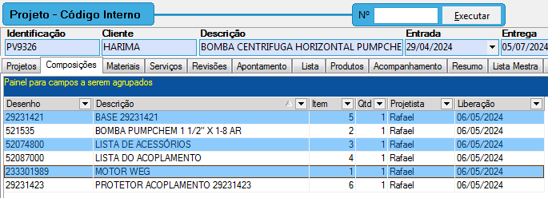

#### 1.2.4.1 C-Cadastrar Composição
Existem 2 formas de cadastrar uma composição, manualmente e por **Listas Standart**, manualmente será utilizado para itens que não forem de fabricação, mas sim de peças sobressalente, reformas, etc.

#### 1.2.4.2 Manualmente
Para cadastrar uma composição, você deve estar dentro do projeto, para isso é dar 2 cliques na linha do projeto, ou selecionar o projeto e clicar na aba ***Composições*** no campo **B**.

Os campos necessários de preenchimeno são:

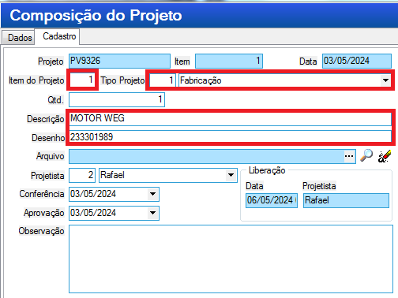

Onde ***Item do Projeto*** e ***Tipo do Projeto*** sempre deverão ser 1

### D. Materiais
Na interface de materiais é onde são cadastrados, de fato, todos os itens do projeto.

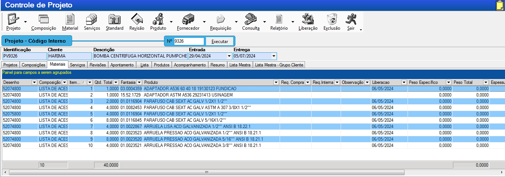

### E. Lista
### F. Acompanhamento
### G. Projeto
### H. Composição
### I. Material
### J. Standart
### K. Requisição
### L. Liberação

---
# 2. Sadi

---
# 3.Hailer
Nosso software para gerenciar processos dos pedidos.

# 3.1Módulos
# 3.1.1 PCP em carga
Onde fica todos os PV's desde a abertura até expedição. Nos ajuda a ver em qual fase (Área) do processo o pedido está e qual ação está aguardando.

# 3.2 Como inserir dados no Hailer
Existem duas formas de inserir dados no Hailer:
# 3.2.1 Manual
Clique em  e abrirá um menu lateral para você inserir os dados
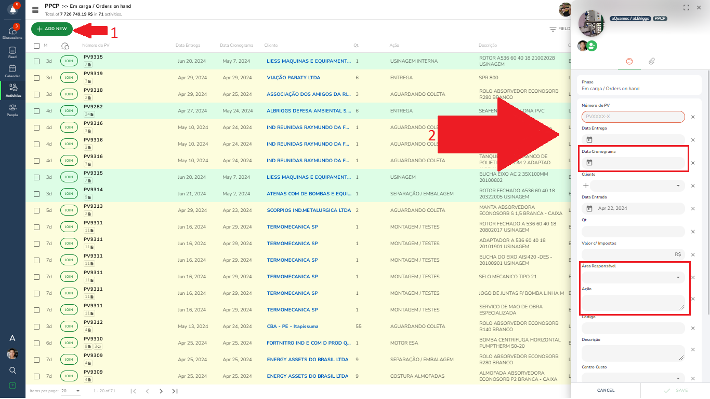

A ***Data Cronograma*** será preenchida posteriormente somente pelo supervisor do PCP após ter elaborado o cronograma do pedido.

Na ***Área responsável e Ação*** são inseridos qual etapa do processo se encontra o pedido. Se for um pedido de bombas e válvulas, **sempre** precisará de desenho da engenharia para poder dar continuidade, então a Área responsável será preenchida com *ENGENHARIA* e a ação com *AGUARDANDO DESENHOS*

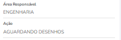

Para pedidos padrões da Lamor cujo não é necessária a etapa de engenharia, conforme imagem vista no tópico 1.2, será aberto já como *ALMOXARIFADO* e *VERIFICANDO ESTOUE*.

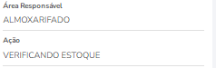

Nas ***Observações*** deverá ser inserido o tipo de frete para o pedido e a transportadora. Essas informações são encontradas no pedido. Se o frete for *FOB* e não tiver transportadora insira como *FRETE: FOB - CLIENTE IRÁ DEFINIR*, caso seja *CIF* e não tiver a transportadora apenas insira *FRETE: CIF*, caso contrário, insira o tipo de frete e o nome da transportadora.

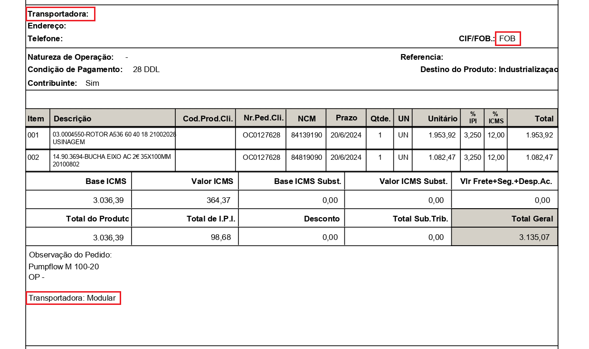

***Coordenadores***
> Os coordenadores do módulo PPCP e dos outros são diferentes vide tabela abaixo

|Setores|PPCP|Outros|
|:-------|:----|:------|
|Aquamec|Lucas Azevedo|Se ÁREA = montagem, então é Jean, se ÁREA = Fabricação, então é Wellington|
|Bombas/Válvulas|Lucas Azevedo|Cristiano Sebastião|
|Lamor|Hilton Júnior|Jean Leme|

# 3.2.2 Importando dados
Muito útil para pedidos grandes.
Selecione os seguintes botões
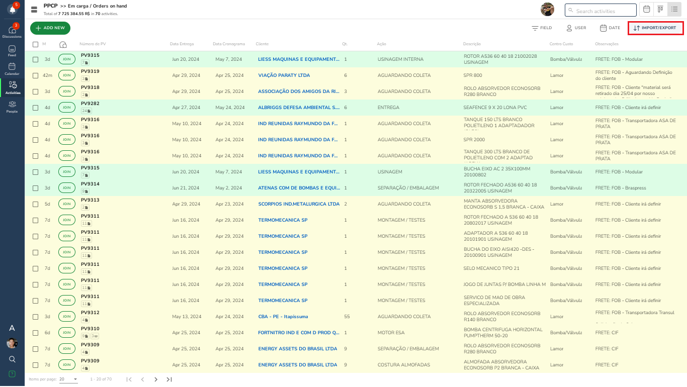

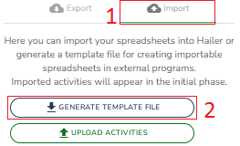

Uma planilha, contendo em seu nome a palavra "template", será gerada. Ali você deve preencher com os dados que quer inserir no módulo do Hailer, aqui está um modelo.

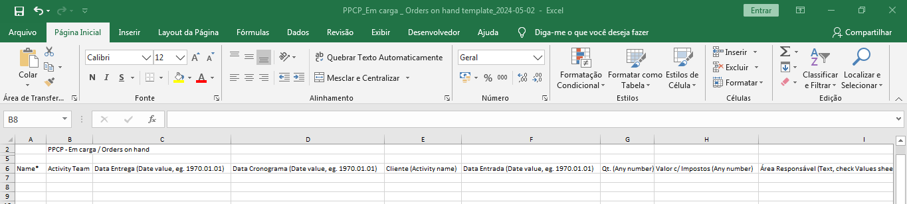

>[!WARNING]
>Por se tratar de um sistema holandês, nos campos de **data** o único formato aceito pelo Hailer é **"AAAA.MM.DD"**.
>E todos os campos, exceto *valor com impostos* deve ser do tipo texto. Por isso insira o código do pedido com uma aspas simples, se não o excel converterá o código em número.

> [!IMPORTANT]
> Quando haver um pedido grande (com várias linhas) é importante adicionar o valor do IPI em cima do preço total de cada item, para o valor final bater com o valor total do pedido. Para esse processo fica mais fácil importar os dados através do excel.

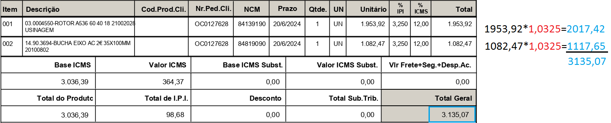

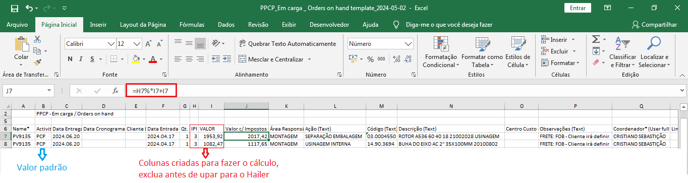

>[!Tip]
>Não é necessário ter todos os campos preenchidos para poder fazer o upload no hailer e nem todos os campos serão upados mesmo se preenchidos, por exemplo: se existir mais de um cliente cadastrado com o mesmo nome (duplicidade), ou se estiver com o nome errado, o sistema irá upar o campo como vazio. Posteriormente ao upload esses dados poderão ser inseridos em conjunto conforme mostrado na seção 3.2.

### 3.1.2 PCP concluído
Onde fica todos os PV's que já foram atendidos (expedidos)
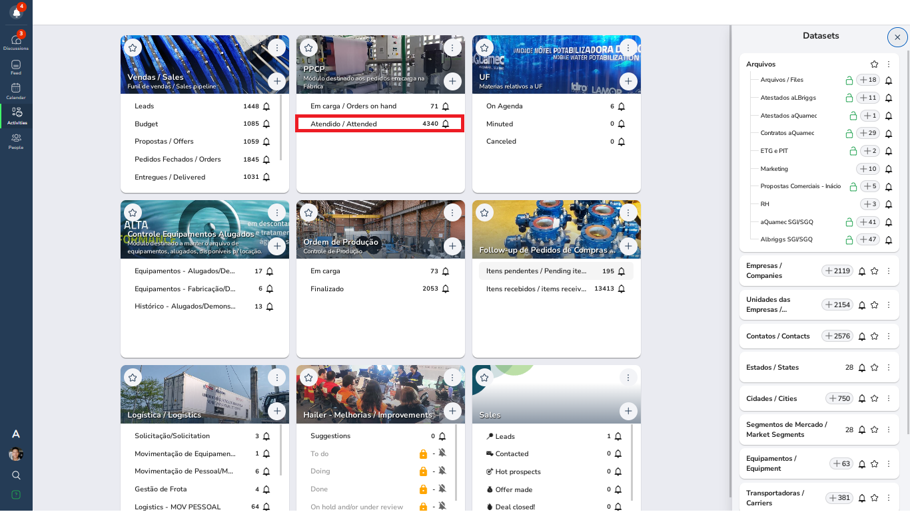
### 3.1.3 Follow Up pendentes
Onde fica os itens que controlamos e está pendente de recebimento.
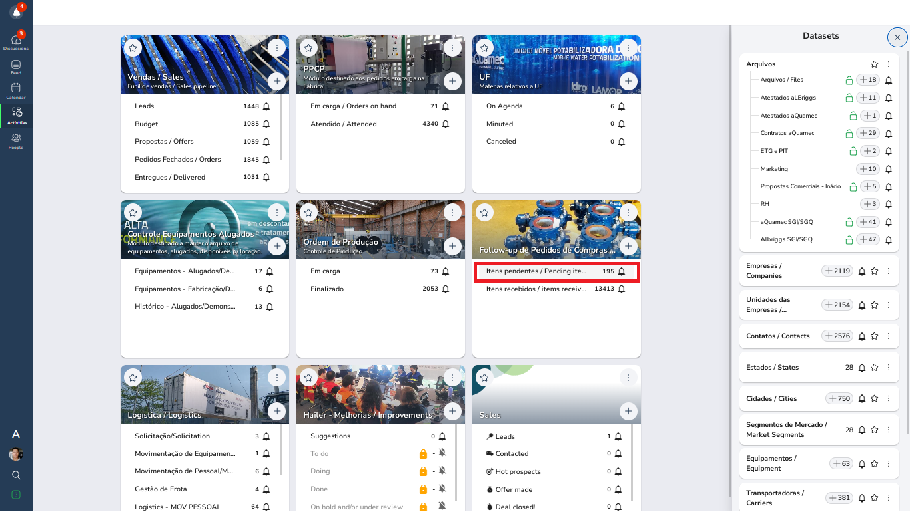

As informações contidas nesse módulo vem do sistema Sadi (compras)

### 3.1.4 Follow Up recebidos

### 3.1.5 Ordem de produção em carga
Onde ficam todos os pedidos que estão em produção atualmente.
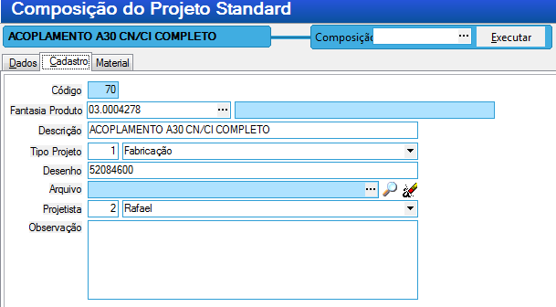

### 3.1.6 Ordem de produção finalizado
Onde ficam todos os pedidos que estavam em produção e foram finalizados.

---
# 3.2 Como editar dados no Hailer

---

## Planilha de Análise Hailer
## Rotinas
## Solicitação Costumar (Dona Maria)
## Horas funcionários
### Planilha de Análise Horas Funcionários
## Plano de corte
## Solicitação NF de remessa para industrialização
