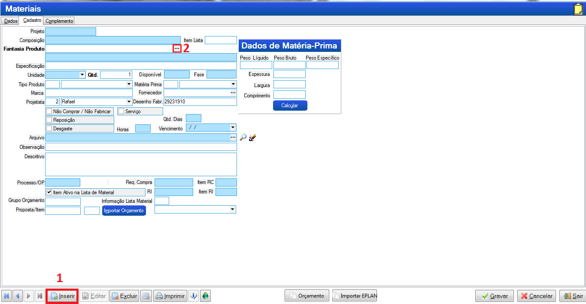

# Guia de operações PCP
---
# 1. Egis

Nosso sistema para construção das árvores dos pedido e emissão de requisições.

>**Usuário:** Guilherme
>**Senha:** gro0924

## 1.1 Vendas
Assim que o comercial encaminha um pedido por e-mail, deve ser cadastrado no módulo de ***`Vendas internas`*** no EGIS para dar continuidade às operações.

### 1.1.1 Tipos de pedido
Existem 3 tipos de pedidos. Para saber diferenciar entre eles é necessário ter um pouco de experiência para saber o que é um equipamento e o que não é.

* **Pedidos de fabricação:**

* **Pedidos de sobressalentes:**
Pedidos que contém peças de itens que compõe os equipamentos.

* **Pedidos de reforma:**
Um de seus itens é um serviço de mão de obra.

### 1.1.2 Inserindo um pedido no EGIS
>Acesse o módulo de vendas
>
>

>Selecione a operação desejada no menu lateral:
>
>

>Assim que abrir o menu de pedidos clique em ***`Cliente`*** para inserir um novo pedido. 
>
>

>[!NOTE]
>Os Nº de pedido são gerados automaticamente em sequência, não é possível escolher eles. Se você estiver precisando cadastrar um pedido com um Nº que não é o maior imediato ao último cadastrado será necessário cadastrar pedidos com cliente e produto genérico para preencher o gap.
>
>Exemplo: O último PV cadastrado é o PV0001 e você quer cadastrar o PV0005, você terá que cadastrar antes todos os PVs até chegar no PV0005. Pode cadastrar como clente aQuamec com os itens em branco e depois alterar o cliente e os itens.

>[!WARNING] 
>
>As vezes o EGIS pula um número de pedido. É uma falha sistêmica, quando isso acontecer não tem nada que possamos fazer. Continue cadastrando a partir do número que pulou.

>Na próxima tela clique em CNPJ para procurar o cliente e selecione o que mais parecer com o cliente do pedido.
>
>

>Se não tiver o cliente cadastrado clique em ***`inserir`*** no canto inferior esquerdo e preencha os dados do cliente no próximo formulário. Os campos mais importantes são os destacados em vermelho.
>
>
>
>

>Feito isso, um novo Nº de PV será gerado e voce poderá inserir os itens do pedido.
>
>

>No final clique em gravar e saia do módulo!
>
>

### 1.1.3 Alterando um pedido
>Para alterar os itens de um pedido é só acessá-lo através de menu de pesquisa e alterar seus dados.
>
>

>Para alterar o cliente de um pedido será necessário acessar um menu diferente. Feche o módulo ***`Pedido de vendas`*** permanecendo apenas no módulo de ***`Vendas Internas`*** e selecione o módulo de alteração de cliente no menu esquerdo.
>
>

>Na próxima tela selecione o tipo ***`Pedido de Venda`*** insira o número do pedido e em ***`Cliente`*** clique nos 3 pontos para selecionar o cliente e siga os passos de inserir clientes explicado anteriormente no item ***1.1.2***
>
>

## 1.2 Engenharia

Todos os pedidos precisam ser engenheirados (ter desenho e lista de materiais) exceto itens padrões da lamor, tais como os abaixo:

Mas, **engenheirados ou não**, todos os itens precisam ter uma árvore no EGIS onde será feito requisição interna para retirá-los do estoque, ou de compra. Essa árvore deve ser aberta no módulo de engenharia após ter recebido os documentos da engeharia e cadastrado o pedido no módulo de vendas.

>Quando é um equipamento completo os documentos da engenharia, tais como as listas e desenhos, ficam salvos na rede ***Desenhos*** dentro da pasta ***PV_BOMBAS_E_VALVULAS*** ou dentro das pastas com o Nº do ano para os itens que são ***AQUAMEC***
>
>

>**Exemplo de lista da engenharia:**
>
>

>**Exemplo de desenho de montagem:** 
>
>São aqueles que possuem no uma lista na descrição
>
>

### 1.2.1 Explicando a interface

>**Acessar módulo de engenharia:**
>
> 
>
>

### 1.2.2 A-Colunas
Ao arrastar as colunas para cima ou para baixo você pode remover elas, ao clicar no botão  no menu inferior um menu lateral é aberto para você poder selecionar quais colunas quer ver.

### 1.2.3 A-Projetos
Na aba de projetos é possível ver os pedidos. Para cadastrar um pedido você deve inicar um projeto.

### 1.2.3.1 C-Cadastrar Projeto
Para cadastrar um projeto, você deve cadastrá-lo utilizando o menu . Os campos necessários para cadastrá-lo e o formato padrão para cadastro é:

>Assim que o inserir o ***`item`*** do ***`pedido de venda`*** e pressionar *tab* os dados do cliente e o ***`Nome do produto do cliente`*** serão preenchidos automaticamente com as informações cadastradas no módulo de vendas,conforme visto no tópico [1.1.2 Inserindo um pedido]. 

>[!IMPORTANT]
>
>Quando um Nº do pedido é pulado pelo sistema módulo de vendas no EGIS, não será possível preencher os dados automaticamente. Nesse caso preencha esse cadastro sem o Nº do ***`Item`***, para que não tente puxar os dados de maneira automática e insira o restante dos dados de forma manual conforme pedido enviado pelo comercial. E lembre-se de inserir a ***`Quantidade`***.

>Copie o ***`Nome do produto do cliente`*** e cole no ***`Nome interno`*** e no desenho insira o desenho do item, se não tiver também pode ser o nome do produto.

>Em ***`Projetista responsável`*** e ***`liberação`*** a única mudança que haverá em relação à da imagem é o nome do projetista que deverá ser *Josafá* para os itens da *Lamor* e *Rafael* para os demais.

>O ***`Centro de Custo`*** no rodapé também deve ser *`14 - (193) Produção Glass`* para itens de bombas, válvulas e suas partes. *`1 - Aquamec Equipamentos`* para itens da aquamec e *`27 - LAMOR AMBIENTAL`* para os itens da lamor.

### 1.2.4 B-Composições
Na aba de composições são subgrupos do projeto, geralmente divididos conforme os *desenhos* ou *listas* da engenharia.

### 1.2.4.1 C-Cadastrar Composição
Existem 2 formas de cadastrar uma composição, manualmente e por **Listas Standart**, manualmente será utilizado **somente** para itens que não forem de fabricação, mas sim de peças sobressalente, reformas, etc.

### 1.2.4.1.1 Manualmente

Forma de cadastro de composição utilizada **somente** para pedidos de sobressalentes

Para cadastrar uma composição, você deve estar dentro do projeto, para isso de 2 cliques na linha do projeto, ou selecionar o projeto e clique na aba ***`Composições`*** no campo **B**.

Os campos necessários de preenchimeno são:

Onde ***`Item do Projeto`*** e ***`Tipo do Projeto`*** sempre deverão ser 1

O desenho deve ser sempre o Nº da lista da engenharia, que pode ser encontrado na capa da OP ou na própria lista:

### 1.2.4.1.1.1 Materiais
>Na interface de materiais é onde são cadastrados, de fato, todos os itens do projeto.
>
>

Para cadastrá-los, primeiro você deve estár dentro de uma composição. Para isso dê 2 cliques em uma composição, ou clique 1 vez e clique na aba de ***`Materiais`*** no campo **B**.

>Após isso clique no ícone de ***`Material`*** no campo **C** e um formulário se abrirá para você pesquisar o item do pedido. Clique no botão de inserir um novo pedido e logo após nos 3 pontos ao lado de **Fantasia Produto**
>
>

>Após isso um buscador se abrirá para você pesquisar o material. Pesquise pelo código ou pelo nome até achar o item desejado. Clique duas vezes sobre ele no botão ***Confirmar*** para adicioná-lo à lista de materiais do projeto.
>
>

Existem duas colunas de quantidade, onde numa é possível ver a quantidade inserida na lista e noutra é possível ver a quantidade total do projeto. 

>[!Note]
>
>Essa quantidade total é calculada multiplicando a quantidade que você inseriu durante essa fase de cadastro de materiais, a quantidade da composição e a quantidade do projeto, inseridos durante a inserção de seus respectivos cadastros.

Após concluir o preenchimento da lista de materiais clique no botão de salvar no canto inferior direito.

>[!TIP]
>
>Para pesquisar os itens utilize os caracteres **"%"**, por exemplo:
>
>`%bomba` trará os resultados que terminem com *bomba*.
>
>`bomba%` trará os resultados que comecem com *bomba*.
>
>`%bomba%` trará os resultados que contenham *bomba*.
>
>`%bomba%centrífuga%` trará os resultados que contenham *bomba* seguido de *centrífuga* com qualquer palavra no começo, no final e entre eles 

>[!TIP]
>
>As vezes você encontrará itens com descrições semelhantes ou em duplicidade. Para saber qual o mais correto a se usar organize a coluna *`disponibilidde`* do maior para o menor, o qua tiver maior número de movimentações é o mais correto.

>[!WARNING]
>
>Se não encontrar o produto específico deve ser solicitado o cadastro ao responsável por essa atividade.

### 1.2.4.1.2 Composição Standart

Outra forma de cadastrar uma composição é pelas listas Standart quando receber a lista, ou desenho da engenharia. 

Os desenhos de usinagem (exceto bases de bomba e protetores do acoplamento de bombas) e fundição não precisam ser cadastrados, porém os desenhos de montagem, também chamados de desenho de conjunto geral, precisam.

### 1.2.4.1.3 Cadastrando Listas Standarts

>Acesse ***`listas standart`*** dentro do campo **C**
>
>

>No menu ***`Dados`*** clique em ***`Inserir`*** para adicionar uma nova composição
>
>

Na composição standart insira um código, pode ser qualquer um já que terá que mudar o descrição para o aquela que mais te servir.

>Cadastrar a composição no item assim como foi explicado na etapa *1.2.4.1.1* 
>

>Em seguida clique na aba ***`Material`*** para inserir os itens da composição. Essa aba contém duas abas de ***`dados`*** e ***`cadastro`***. Onde ***`cadastro`*** é o lugar que o item deve ser inserido e ***`dados`*** é onde são visualizados.
>
>

>Na aba de ***`cadastro`*** os campos necessários de preenchimento são os destacados na imagem abaixo. Sendo o tipo de produto e matéria prima os únicos constantes
>
>

>[!WARNING]
>
>Se não for inserido o Tipo ***`Produto`*** e a ***`Matéria Prima`*** dará um erro.

>Terminado de criar a composição, feche a janela. Escolha um projeto e dentro da aba  ***`Composições`*** no campo **B** clique em ***`Composição`*** no campo **C**.
>
>
>
>Selecione composição Standart no roda pé e na janela que abrir selecione todas as composições desejadas, conforme nº do ***`desenho`*** (que também pode ser a lista da engenharia) e clique em ok
>
>
>
>

>[!NOTE]
>
>Vamos revisar. No campo **B**:
>>Existe a aba de ***`projetos`***. Que são abertos conforme PV.
>>>Dentro do projeto existem ***`composições`***. Que são abertas conforme os desenhos, ou listas
>>>>Dentro das composições existem os ***`materiais`***. Que são abertos conforme os materiais dentro dos desenhos, ou listas.

### 1.2.5 Lista (Campo B)

Nessa aba é possível ver todos os itens que vão no pedido, mesmo que estejam em projetos diferentes, de forma resumida, ou seja, agrupados: Se tiver dois itens iguais dentro do mesmo projeto o item é mostrado apenas uma vez e a qantidade base(quantidade sem multiplicação) e somado, se tiver em projetos diferentes é mostrado uma vez para cada projeto.

E as quantidades não são multiplicadas.

>[!TIP]
>
>Se quiser ver o mesmo resumo, mas contendo uma coluna separando por composições. Acesse o menu de produtos explicado no tópico *1.2.8.*
>
>Se quiser copiar os dados, exporte para excel ou siga para a próximo tópico *1.2.6 Acompanhamento*
>
>

### 1.2.7 Produtos (Campo B)

Faz a mesma função da lista, porém separa os itens de **1 projeto** por composição e não de vários projetos. E mesmo se tiver mais de 1 item idêntico na composição, não é agrupado.

Nessa aba é possível dar 2 cliques para selecionar e copiar os valores de dentro das células.

### 1.2.8 Acompanhamento (Campo B)

Faz a mesma função da lista, porém é possível dar 2 cliques e selecionar os dados das células. Não é possível editá-los ou inserir novos dados em novas linhas. É possível apenas copiá-los. Mostra os valores agrupados.

### 1.2.9 Liberação (Campo C)
### 1.2.10 Requisição (Campo C)

---
# 2. Sadi

---
# 3.Hailer
Nosso software para gerenciar processos dos pedidos.

# 3.1Módulos
# 3.1.1 PCP em carga
Onde fica todos os PV's desde a abertura até expedição. Nos ajuda a ver em qual fase (Área) do processo o pedido está e qual ação está aguardando.

# 3.2 Como inserir dados no Hailer
Existem duas formas de inserir dados no Hailer:
# 3.2.1 Manual
Clique em  e abrirá um menu lateral para você inserir os dados

A ***Data Cronograma*** será preenchida posteriormente somente pelo supervisor do PCP após ter elaborado o cronograma do pedido.

Na ***Área responsável e Ação*** são inseridos qual etapa do processo se encontra o pedido. Se for um pedido de bombas e válvulas, **sempre** precisará de desenho da engenharia para poder dar continuidade, então a Área responsável será preenchida com *ENGENHARIA* e a ação com *AGUARDANDO DESENHOS*

Para pedidos padrões da Lamor cujo não é necessária a etapa de engenharia, conforme imagem vista no tópico 1.2, será aberto já como *ALMOXARIFADO* e *VERIFICANDO ESTOUE*.

Nas ***Observações*** deverá ser inserido o tipo de frete para o pedido e a transportadora. Essas informações são encontradas no pedido. Se o frete for *FOB* e não tiver transportadora insira como *FRETE: FOB - CLIENTE IRÁ DEFINIR*, caso seja *CIF* e não tiver a transportadora apenas insira *FRETE: CIF*, caso contrário, insira o tipo de frete e o nome da transportadora.

***Coordenadores***
> Os coordenadores do módulo PPCP e dos outros são diferentes vide tabela abaixo

|Setores|PPCP|Outros|
|:-------|:----|:------|
|Aquamec|Lucas Azevedo|Se ÁREA = montagem, então é Jean, se ÁREA = Fabricação, então é Wellington|
|Bombas/Válvulas|Lucas Azevedo|Cristiano Sebastião|
|Lamor|Hilton Júnior|Jean Leme|

# 3.2.2 Importando dados
Muito útil para pedidos grandes.
Selecione os seguintes botões

Uma planilha, contendo em seu nome a palavra "template", será gerada. Ali você deve preencher com os dados que quer inserir no módulo do Hailer, aqui está um modelo.

>[!WARNING]
>Por se tratar de um sistema holandês, nos campos de **data** o único formato aceito pelo Hailer é **"AAAA.MM.DD"**.
>E todos os campos, exceto *valor com impostos* deve ser do tipo texto. Por isso insira o código do pedido com uma aspas simples, se não o excel converterá o código em número.

> [!IMPORTANT]
> Quando haver um pedido grande (com várias linhas) é importante adicionar o valor do IPI em cima do preço total de cada item, para o valor final bater com o valor total do pedido. Para esse processo fica mais fácil importar os dados através do excel.

>[!Tip]
>Não é necessário ter todos os campos preenchidos para poder fazer o upload no hailer e nem todos os campos serão upados mesmo se preenchidos, por exemplo: se existir mais de um cliente cadastrado com o mesmo nome (duplicidade), ou se estiver com o nome errado, o sistema irá upar o campo como vazio. Posteriormente ao upload esses dados poderão ser inseridos em conjunto conforme mostrado na seção 3.2.

### 3.1.2 PCP concluído
Onde fica todos os PV's que já foram atendidos (expedidos)

### 3.1.3 Follow Up pendentes
Onde fica os itens que controlamos e está pendente de recebimento.

As informações contidas nesse módulo vem do sistema Sadi (compras)

### 3.1.4 Follow Up recebidos

### 3.1.5 Ordem de produção em carga
Onde ficam todos os pedidos que estão em produção atualmente.

### 3.1.6 Ordem de produção finalizado
Onde ficam todos os pedidos que estavam em produção e foram finalizados.

---
# 3.2 Como editar dados no Hailer

---

## Planilha de Análise Hailer
## Rotinas
## Solicitação Costumar (Dona Maria)
## Horas funcionários
### Planilha de Análise Horas Funcionários
## Plano de corte
## Solicitação NF de remessa para industrialização
