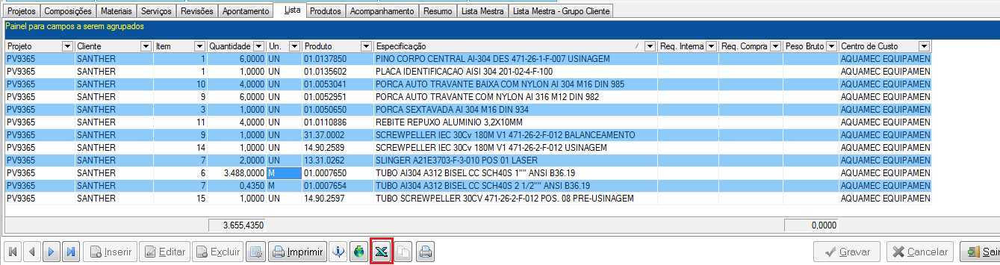
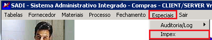
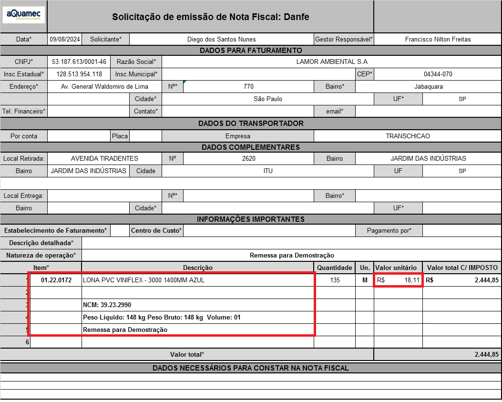
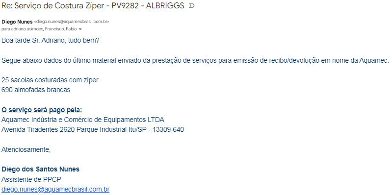

# Guia de operações PCP

Abaixo está uma estrutura de como é a sequência do fluxo de trabalho do PCP:

## 1. Egis

Nosso sistema para construção das árvores dos pedido e emissão de requisições.

>**Usuário:** Guilherme
>**Senha:** gro0924

### 1.1 Vendas
Assim que o comercial encaminha um pedido por e-mail, deve ser cadastrado no módulo de ***`Vendas internas`*** no EGIS para dar continuidade às operações.

#### 1.1.1 Tipos de pedido

---

Existem 3 tipos de pedidos. Para saber diferenciar entre eles é necessário ter um pouco de experiência para saber o que é um equipamento e o que não é.

* **Pedidos de fabricação:**

* **Pedidos de sobressalentes:**
Pedidos que contém peças de itens que compõe os equipamentos.

* **Pedidos de reforma:**
Um de seus itens é um serviço de mão de obra.

#### 1.1.2 Inserindo um pedido no EGIS

---

>Acesse o módulo de vendas
>
>

>Selecione a operação desejada no menu lateral:
>
>

>Assim que abrir o menu de pedidos clique em ***`Cliente`*** para inserir um novo pedido. 
>
>

>[!NOTE]
>
>Os Nº de pedido são gerados automaticamente em sequência, não é possível escolher eles. Se você estiver precisando cadastrar um pedido com um Nº que não é o maior imediato ao último cadastrado será necessário cadastrar pedidos com cliente e produto genérico para preencher o gap.
>
>Exemplo: O último PV cadastrado é o PV0001 e você quer cadastrar o PV0005, você terá que cadastrar antes todos os PVs até chegar no PV0005. Pode cadastrar como cliente aQuamec com os itens em branco e depois alterar o cliente e os itens.

>[!WARNING] 
>
>As vezes o EGIS pula um número de pedido. É uma falha sistêmica, quando isso acontecer não tem nada que possamos fazer. Continue cadastrando a partir do número que pulou.

>Na próxima tela clique em CNPJ para procurar o cliente e selecione o que mais parecer com o cliente do pedido.
>
>

>Se não tiver o cliente cadastrado clique em ***`inserir`*** no canto inferior esquerdo e preencha os dados do cliente no próximo formulário. Os campos mais importantes são os destacados em vermelho.
>
>
>
>

>Feito isso, um novo Nº de PV será gerado e você poderá inserir os itens do pedido.
>
>

>No final clique em gravar e saia do módulo!
>
>

#### 1.1.3 Alterando um pedido

---

>Para alterar os itens de um pedido é só acessá-lo através de menu de pesquisa e alterar seus dados.
>
>

>Para alterar o cliente de um pedido será necessário acessar um menu diferente. Feche o módulo ***`Pedido de vendas`*** permanecendo apenas no módulo de ***`Vendas Internas`*** e selecione o módulo de alteração de cliente no menu esquerdo.
>
>

>Na próxima tela selecione o tipo ***`Pedido de Venda`*** insira o número do pedido e em ***`Cliente`*** clique nos 3 pontos para selecionar o cliente e siga os passos de inserir clientes explicado anteriormente no item ***1.1.2***
>
>

### 1.2 Engenharia

Todos os pedidos precisam ser engenheirados (ter desenho e lista de materiais) exceto itens padrões da lamor, tais como os abaixo:

Mas, **engenheirados ou não**, todos os itens precisam ter uma árvore no EGIS onde será feito requisição interna para retirá-los do estoque, ou de compra. Essa árvore deve ser aberta no módulo de engenharia após ter recebido os documentos da engenharia e cadastrado o pedido no módulo de vendas.

>Quando é um equipamento completo os documentos da engenharia, tais como as listas e desenhos, ficam salvos na rede ***Desenhos*** dentro da pasta ***PV_BOMBAS_E_VALVULAS*** ou dentro das pastas com o Nº do ano para os itens que são ***AQUAMEC***
>
>

>**Exemplo de lista da engenharia:**
>
>

>**Exemplo de desenho de montagem:** 
>
>São aqueles que possuem no uma lista na descrição
>
>

#### 1.2.1 Explicando a interface

---

>**Acessar módulo de engenharia:**
>
> 
>
>

#### 1.2.2 A-Colunas

---

Ao arrastar as colunas para cima ou para baixo você pode remover elas, ao clicar no botão  no menu inferior um menu lateral é aberto para você poder selecionar quais colunas quer ver.

#### 1.2.3 A-Projetos

---

Na aba de projetos é possível ver itens dos pedidos que o comercial nos envia.

>[!NOTE]
>
>Item do peido = Projeto
>
>Cada item do pedido deve ser cadastrado como um projeto diferente, com o mesmo PV. Conforme visto na imagem do tópico [1.2.1-Explicando a interface](###1.2.1-Explicando-a-interface)

Para cadastrar um pedido você deve iniciar um projeto.

##### 1.2.3.1 C-Cadastrar Projeto
---
Para cadastrar um projeto, você deve cadastrá-lo utilizando o menu . Os campos necessários para cadastrá-lo e o formato padrão para cadastro é:

>Assim que o inserir o ***`item`*** do ***`pedido de venda`*** e pressionar *tab* os dados do cliente e o ***`Nome do produto do cliente`*** serão preenchidos automaticamente com as informações cadastradas no módulo de vendas,conforme visto no tópico [1.1.2-Inserindo um pedido](###1.1.2-Inserindo-um-pedido). 

>[!IMPORTANT]
>
>Quando um Nº do pedido é pulado pelo sistema módulo de vendas no EGIS, não será possível preencher os dados automaticamente. Nesse caso preencha esse cadastro sem o Nº do ***`Item`***, para que não tente puxar os dados de maneira automática e insira o restante dos dados de forma manual conforme pedido enviado pelo comercial. E lembre-se de inserir a ***`Quantidade`***.

>Copie o ***`Nome do produto do cliente`*** e cole no ***`Nome interno`*** e no desenho insira o desenho do item, se não tiver também pode ser o nome do produto.

>Em ***`Projetista responsável`*** e ***`liberação`*** a única mudança que haverá em relação à da imagem é o nome do projetista que deverá ser *Josafá* para os itens da *Lamor* e *Rafael* para os demais.

>O ***`Centro de Custo`*** no rodapé também deve ser ***`14 - (193) Produção Glass`*** para itens de bombas, válvulas e suas partes. ***`1 - Aquamec Equipamentos`*** para itens da aquamec e ***`27 - LAMOR AMBIENTAL`*** para os itens da lamor.

#### 1.2.4 B-Composições

---

Na aba de composições são subgrupos do projeto, geralmente divididos conforme os *desenhos* ou *listas* da engenharia.

##### 1.2.4.1 C-Cadastrar Composição

---

Existem 2 formas de cadastrar uma composição, manualmente e por **Listas Standard**, manualmente será utilizado **somente** para itens que não forem de fabricação, mas sim de peças sobressalente, reformas, etc.

###### 1.2.4.1.1 Manualmente

---

Forma de cadastro de composição utilizada **somente** para pedidos de sobressalentes

Para cadastrar uma composição, você deve estar dentro do projeto, para isso de 2 cliques na linha do projeto, ou selecionar o projeto e clique na aba ***`Composições`*** no campo **B**.

Os campos necessários de preenchimento são:

Onde ***`Item do Projeto`*** e ***`Tipo do Projeto`*** sempre deverão ser 1

O desenho deve ser sempre o Nº da lista da engenharia, que pode ser encontrado na capa da OP ou na própria lista:

###### 1.2.4.1.1.1 Materiais

---

>Na interface de materiais é onde são cadastrados, de fato, todos os itens do projeto.
>
>

Para cadastrá-los, primeiro você deve estar dentro de uma composição. Para isso dê 2 cliques em uma composição, ou clique 1 vez e clique na aba de ***`Materiais`*** no campo **B**.

>Após isso clique no ícone de ***`Material`*** no campo **C** e um formulário se abrirá para você pesquisar o item do pedido. Clique no botão de inserir um novo pedido e logo após nos 3 pontos ao lado de **Fantasia Produto**
>
>

>Após isso um buscador se abrirá para você pesquisar o material. Pesquise pelo código ou pelo nome até achar o item desejado. Clique duas vezes sobre ele no botão ***Confirmar*** para adicioná-lo à lista de materiais do projeto.
>
>

Existem duas colunas de quantidade, onde numa é possível ver a quantidade inserida na lista e noutra é possível ver a quantidade total do projeto. 

>[!Note]
>
>Essa quantidade total é calculada multiplicando a quantidade que você inseriu durante essa fase de cadastro de materiais, a quantidade da composição e a quantidade do projeto, inseridos durante a inserção de seus respectivos cadastros.

Após concluir o preenchimento da lista de materiais clique no botão de salvar no canto inferior direito.

>[!TIP]
>
>Para pesquisar os itens utilize os caracteres **"%"**, por exemplo:
>
>`%bomba`*** trará os resultados que terminem com *bomba*.
>
>`bomba%`*** trará os resultados que comecem com *bomba*.
>
>`%bomba%`*** trará os resultados que contenham *bomba*.
>
>`%bomba%centrífuga%`*** trará os resultados que contenham *bomba* seguido de *centrífuga* com qualquer palavra no começo, no final e entre eles 

>[!TIP]
>
>As vezes você encontrará itens com descrições semelhantes ou em duplicidade. Para saber qual o mais correto a se usar organize a coluna ***`disponibilidade`*** do maior para o menor, o qua tiver maior número de movimentações é o mais correto.

>[!WARNING]
>
>Se não encontrar o produto específico deve ser solicitado o cadastro ao responsável por essa atividade.

###### 1.2.4.1.2 Composição Standard

---

Outra forma de cadastrar uma composição é pelas listas Standard quando receber a lista, ou desenho da engenharia. 

Os desenhos de usinagem (exceto bases de bomba e protetores do acoplamento de bombas) e fundição não precisam ser cadastrados, porém os desenhos de montagem, também chamados de desenho de conjunto geral, precisam.

###### 1.2.4.1.3 Cadastrando Listas Standards

---

>Acesse ***`listas standard`*** dentro do campo **C**
>
>

>No menu ***`Dados`*** clique em ***`Inserir`*** para adicionar uma nova composição
>
>

Na composição standard insira um código, pode ser qualquer um já que terá que mudar o descrição para o aquela que mais te servir.

>Cadastrar a composição no item assim como foi explicado na etapa *1.2.4.1.1* 
>

>Em seguida clique na aba ***`Material`*** para inserir os itens da composição. Essa aba contém duas abas de ***`dados`*** e ***`cadastro`***. Onde ***`cadastro`*** é o lugar que o item deve ser inserido e ***`dados`*** é onde são visualizados.
>
>

>Na aba de ***`cadastro`*** os campos necessários de preenchimento são os destacados na imagem abaixo. Sendo o tipo de produto e matéria prima os únicos constantes
>
>

>[!WARNING]
>
>Se não for inserido o Tipo ***`Produto`*** e a ***`Matéria Prima`*** dará um erro.

>Terminado de criar a composição, feche a janela. Escolha um projeto e dentro da aba  ***`Composições`*** no campo **B** clique em ***`Composição`*** no campo **C**.
>
>
>
>Selecione composição Standard no roda pé e na janela que abrir selecione todas as composições desejadas, conforme nº do ***`desenho`*** (que também pode ser a lista da engenharia) e clique em ok
>
>
>
>

>[!NOTE]
>
>Vamos revisar. No campo **B**:
>>Existe a aba de ***`projetos`***. Que são abertos conforme PV.
>>>Dentro do projeto existem ***`composições`***. Que são abertas conforme os desenhos, ou listas
>>>>Dentro das composições existem os ***`materiais`***. Que são abertos conforme os materiais dentro dos desenhos, ou listas.

#### 1.2.5 Lista (Campo B)

---

Nessa aba é possível ver todos os itens que vão no pedido, mesmo que estejam em projetos diferentes, de forma resumida, ou seja, agrupados: Se tiver dois itens iguais dentro do mesmo projeto o item é mostrado apenas uma vez e a quantidade base(quantidade sem multiplicação) e somado, se tiver em projetos diferentes é mostrado uma vez para cada projeto.

E as quantidades não são multiplicadas.

>[!TIP]
>
>Se quiser ver o mesmo resumo, mas contendo uma coluna separando por composições. Acesse o menu de produtos explicado no tópico *1.2.8.*
>
>Se quiser copiar os dados, exporte para excel ou siga para a próximo tópico *1.2.6 Acompanhamento*
>
>

#### 1.2.6 Produtos (Campo B)

---

Faz a mesma função da lista, porém separa os itens de **1 projeto** por composição e não de vários projetos. E mesmo se tiver mais de 1 item idêntico na composição, não é agrupado.

Nessa aba é possível dar 2 cliques para selecionar e copiar os valores de dentro das células.

#### 1.2.7 Verificação de estoque.

---

Após ter inserido o projeto, as composições e os itens das composições, o próximo passo é enviar para o almoxarifado verificar e separar o estoque.

Para isso, monte um email conforme imagem abaixo. Encaminhando junto os documentos enviados pela engenharia.

O almoxarifado responderá com a seguinte lista. Indicando o que tem e o que não tem em estoque:

Para os itens que foram marcados que temos disponível, faça uma requisição interna. (Continue a partir do passo 10-Plano de corte)

Para os itens que não temos disponível existem duas rotas a se tomar:

* Para o itens comerciais e fundidos faça uma requisição de compra.

* Para os itens usinados, imprima o desenho de usinagem, leve até o responsável pelo setor de usinagem (Atualmente é o Sr. Cristiano Sebastião), ele lhe dirá o que ele conseguirá fazer internamente e o que será necessário fazer uma requisição de compra do serviço de usinagem.

    Se ele for fazer internamente, faça uma requisição interna da usinagem. Se for externo existem duas rotas:

    * Verifique se o item é usinado a partir de fundido ou matéria prima. Na lista da engenharia está indicando isso.

    >
    >
    >Os itens acima são usinados a partir de fundidos. Os códigos dos desenhos dos fundidos começam com o número 1 e 2 para os usinados. Além disso, na descrição é possível observar que esses desenhos estão ligados com apenas um item.

    >
    >
    >Os itens acima são usinados a partir de matéria prima. Na descrição é possível observar que existem mais de um item e abaixo está descrito a matéria prima que será usinada para virar o item acima.

    * Para os itens usinados a partir de fundidos: Faça uma requisição de compra normalmente. Se já tivermos os fundidos em estoque, solicite a separação e a *liberação da Nota Fiscal de envio de remessa para industrialização*. Se não tiver em estoque, requisite a compra e aguarde o recebimento deles para depois solicitar.

    * Para os itens usinados a partir de matéria prima: Verifique se ele é comprado já com a matéria prima. Se for, é necessário fazer apenas a solicitação de compra. Se não for, faça um ***`Plano de Corte`*** e entregue ao responsável pelo setor de caldeiraria/fabricação (atualmente o Sr. Wellington Pereira).

#### 1.2.8 Liberação (Campo C)

---

Após as árvores terem sido feitas. Tire um print do projeto e envie para o almoxarifado verificar os itens que temos disponíveis em estoque.

Alguns códigos, naturalmente, estarão errados e o almoxarifado corrigirá. Corrija esses códigos dentro das listas standard e nos itens dentro de cada composição.

>[!WARNING]
>
>Para fazer requisições é necessário que os projetos estejam liberados. Certifique de fazer uma liberação a cada mudança dentro das árvores, se não as requisições não sairão conforme a última alteração.

Selecione o ícone de liberação no menu **C** . Existem duas forma de fazer a liberação

* **Liberar Projeto:** Você não precisa selecionar quais itens quer liberar, pois ela libera tudo que está dentro do projeto de uma vez só. Porém, é mais restritiva, pois ela só libera **1 projeto por vez**. 

    Se o **pedido** tiver vários itens e, por consequência, a árvore tiver vários **projetos**, você terá que sair da tela de liberação após liberar um projeto, entrar em outro projeto, acessar essa tela de liberação e liberar projeto.

    Portanto é melhor usá-la quando o pedido tiver apenas 1 item.

* **Liberar Seleção:** Você consegue liberar todos os projetos e seus itens de uma vez. Porém só funciona uma vez. Se todos os projetos do pedido já tiverem liberados, não será possível utilizar essa função, apenas a liberação de projeto.

    Portanto só a utilize **após** o almoxarifado ter respondido e todas as alterações terem sido feitas nos itens das composições dos projetos.

#### 1.2.9 Requisição (Campo C)

---

Tendo corrigido e liberado a árvore do pedido e alinhado com os coordenadores o que será feito internamente e externamente, é hora de fazer as requisições.

>No campo **C** clique em geração de requisição
>
>

>Na próxima janela que se abrirá, siga a rota abaixo:
>
>
>
>**1.** Clique em pesquisar para buscar os itens do da árvore do pedido. Aqui ele busca os itens de todos os projetos que contenham o título (que inicia com "PV...") semelhante.
>
>**2.** Selecione todos os itens que deseja requisitar.
>
>**3.** Clique para adicionar os itens selecionados na requisição
>
>**4.** E por fim gere a requisição desejada.

Ao clicar em ***`Gerar RI`*** ou ***`Gerar RC`*** abrirá uma janela de confirmação. 

>Para a requisição interna apenas confirme.
>
>

>Para requisição de compra, certifique de ter selecionado o ***`centro de custo`*** correspondente ao Pedido, conforme visto no tópico [1.2.3.1-Cadastrar Projeto (Campo C)](###1.2.3.1-C-Cadastrar-Projeto) e o ***`plano de compras`*** sempre será ***`01.15`***.
>
>

>[!IMPORTANT]
>
>**Sempre** separe as requisições de compra por tipo de produto. Para os itens que são comerciais gere numa requisição de compra para eles, para os fundidos gere outra, para os usinados outra, para os itens de corte à laser outra e para os serviços outra. Conforme mostrado no e-mail abaixo:
>
>Envie o e-mail para o setor de compras e copie seu superior imediato. O gerente da fábrica e o **Coordenador interno** (não o comercial) do pedido.
>
>Encaminhe junto os documentos da engenharia. E lembre de mudar o título.
>
>

Caso seja uma requisição interna, basta responder o e-mail do almoxarifado com a requisição. 

>[!HINT]
>
>Também é interessante separar as requisições internas pelo que será usinado/fabricado internamente e pelo que já temos pronto no almoxarifado. Isso facilitará na hora de inserir essas informações no Hailer.
>
>

## 2. SADI

Sistema por onde suprimentos (compras) controla os pedidos de compra.

Para acessá-lo clique aqui:
[SADI](https://e-lever.com.br/alpina/consultaDinamica/application/views/Consulta%20Dinamica.php)

>**Login:** Nata  
>**Senha:** Ntt@2018 

>
>Acesse o seguinte caminho. É normal que demore um pouco para carregar.
>
>

### 2.1 Importando pedidos do EGIS para o SADI

>Na página inicial do EGIS acesse o menu de compras
>
>

>No menu lateral esquerdo acesse o menu de controle de compras
>
>

>Na próxima tela acesse as requisições em aberto
>
>

>Na tela que se abrirá, selecione a data das requisições que quer ver, clique em pesquisar. Confira se são essas as requisições que quer mesmo e exporte para excel.
>
>

>No documento excel vamos trabalhar com as colunas **`V | X | Y | Z | AA | AH`**
>
>
>
>Siga as instruções abaixo:
>
>* Não delete nenhuma coluna.
>* As colunas X e Y devem estar em branco.
>* Na coluna Z os únicos valores aceitos são:
>   * (193) PRODUÇÃO GLASS
>   * (186) ALMOXARIFADO 
>   * AQUAMEC EQUIPAMENTOS 
>* A coluna ***`Pedido de Venda`*** e ***`Projeto`*** devem ter os mesmos valores, com "PV" na frente. Se o ***`Centro Custo`*** for almoxarifado então ***`Pedido de Venda`*** e ***`Projeto`*** deve ser *FABRICA*.
>* Os itens que foram solicitados por "Mluis" muito provavelmente são itens para estoque. Verifique a requisição que ele enviou no e-mail para ter certeza. A coluna J tem o Nº da requisição.
>
>O resultado final deve ser algo similar a isso:
>
>
>
>Certifique-se que não tenha nenhum espaço branco no início ou final das palavras, se não dará erro.

Tendo feito isso, salve seu arquivo. O Excel pedirá para escolher um local para salvar, no caso, em sua máquina deve ter uma pasta que faça conexão com o sistema NET-CRM, pois ao se tratar de uma máquina virtual o sistema NET-CRM não está conectado com os arquivos do computador. Crie uma pasta **DENTRO DA PASTA** **`C:`** e chame o HelpDesk solicitando essa conexão.

#### 2.1.1 Sistema NET-CRM

---

>Acesse o seguinte caminho
>
>**Login:** nilton2  
>**Senha:** Nlt@2018 
>
>

>Dentro do sistema NET-CRM eu deixei os programas necessários na barra de ferramentas do sistema para ficar mais fácil localizá-los. Mas também estão disponíveis nos ícones na área de trabalho:
>
>

##### 2.1.1.1 IMPEX - Importar Planilha

---

>O primeiro programa que vamos precisar é o IMPEX 
>
>

>Selecione Browser para escolher a planilha a ser importada, que foi feita no passo anterior [2.1 Importando pedidos do EGIS para o SADI](2.1-Importando-pedidos-do-EGIS-para-o-SADI) que deverá ter sido salva na pasta que foi linkada com o NET-CRM pelo HelpDesk.
>
>
>
>Clique em enviar

Se a planilha estiver correta, os dados serão importados com sucesso. Se não estiver, aparecerá mensagens de erro. Esse erro pode ser ocasionado por diversos motivos, espaços em branco, um acento errado, etc. Tem que mexer nos valores da planilha, ou até refazê-la até aceitar.

##### 2.1.1.2 XRP - Consistência

---

Após os dados terem sido importados com sucesso, vamos verificar a consistência dos dados.

>Acesse o XRP > SADI > COMPRAS
>
>  
>  
>
>
>Ao acessar compras pedirá para validar a empresa, apenas confirme, pois a única que tem é a aquamec mesmo.
>
>

>Em seguida pedirá login e senha pra você que são as seguintes:
>
>**Login:** nilton  
>**Senha:** Nlt@2018 

>Nas telas seguintes acesse: Especiais > IMPEX > Importações > Consistência
>
>
>
>

>Selecione executar
>
>

>Uma nova janela se abrirá
>
>Nessa nova janela, primeiro selecione o seguinte caminho: SADIWPRD > CargaReq > TEXTO
>
>Na caixa de seleção da esquerda, selecione o último arquivo, não importa o nome.
>
>

>Na próxima tela que abrir marque a caixa de seleção de ***`Imprime para arquivo`*** e busque pelo arquivo CONSIST
>

>Se abrirá a mesma janela novamente, porém agora o caminho para o arquivo CONSIST é o seguinte: SADIWPRD > CargaReq > CONSIST e selecione o arquivo no menu da esquerda.
>
>

>Ao selecionar o arquivo, irá voltar para a tela de seleção com o caminho do arquivo na caixa de seleção.
>
>Na caixa no nome escreva o nome do arquivo que deseja abrir: "CONSIST" e cliquem em OK
>
>

>Aparecerá um aviso dizendo que a emissão foi concluída. Clique em Ok e abra a pasta onde esse arquivo é salvo automaticamente:
>
>
>
>Dentro dessa pasta existe um arquivo de texto, que compara os itens das requisições feitas com os itens que exitem no cadastro e com as requisições já importadas e retorna caso encontre algum problema. Que geralmente são:
>
> * Requisição já existente:
>   * Para corrigir basta excluir a requisição que já foi importada do arquivo excel.
> * Material com problema no cadastro:
>   * Para corrigir entre no cadastro do item no sistema CRM , e inclua as informações faltantes, geralmente são: Tipo de produto e Classificação fiscal
>
>
>
>>[!NOTE]
>>
>>Lembrando que o NET_CRM, não aceita ***`“”`*** na descrição dos itens, nem mais que 2 números  após a virgula na quantidade da requisição de compra.

###### 2.1.1.2.1 Corrigindo erro de material na consistência

---

>Acesse o sistema comercial da aquamec
>
>**Login:** NATA  
>**Senha:** ntt@2019
>
>
>
>

>Acesse o menu de produtos
>
>

>Na tela seguinte siga os passos:
>
>1. Selecione o operador lógico ***`=`*** na lisa suspensa
>2. Insira o código do produto com erro.
>3. Clique em pesquisar 
>
>

>No cadastro do produto, os campos ***`classificação fiscal`*** e ***`tipo de produto`*** não podem estar vazios. Se estiverem clique em pesquisar no ícone da lupa ao lado
>
>
>
>* **Classificação fiscal:** Caso nao saiba a classificação do produto. Ou não tenha tempo hábil para procurar pode utilizar o campo em vazio:
>
>
>
>* **Tipo de produto:** Caso não saiba o tipo de produto pode utilizar ***`outros`***.
>
>

Realize novamente a consistência até que retorne **0** erro.

##### 2.1.1.3 XRP - Efetivação

---

Tendo as requisições aprovadas na etapa de consistência, podemos, finalmente, inseri-las de fato no sistema.

>Para isso acesse o menu do IMPEX novamente dentro de XRP > SADI > COMPRAS conforme visto no tópico [2.1.1.2 XRP - Consistência](2.1.1.2-XRP-Consistência)
>
>

>Dessa vez, dentro do menu de ***`Importações`*** acesse o menu de ***`Efetivação`***.
>
>

>Na janela que se abrir selecione o último arquivo no menu da esquerda. Não importa o nome.
>
>

Pronto. As requisições ja foram incluídas no sistema. **Avise o gerente da fábrica para que aprove-as.**

##### 2.1.1.4 Visualizando requisições em carga

---

>Acesse o menu XRP > SADI > COMPRAS > PROCESSO > Solicitação de Compra > Incluir/Atualizar SC
>
>

>[!NOTE]
>
>As requisições que foram importadas, mas não foram aprovadas pelo gerente da fábrica ficarão com a letra numa coloração azul escuro, quando aprovadas ficarão vermelhas. 

>[!TIP]
>
>Também é nesse menu onde o pessoal de suprimentos escreve o motivo do cancelamento da compra de determinado item do pedido. Isso será útil mais adiante nesse documento.

>[!WARNING]
>
>Para a próxima etapa siga as instruções no passo [3.1.3.1 Importando pedidos do SADI para o Hailer](3.1.3.1-Importando-pedidos-do-SADI-para-o-Hailer)

## 3. Hailer
Nosso software para gerenciar os processos dos pedidos.

>**Login:** seu email
>
>**Senha:** mesma senha que usa para entrar no computador

### 3.1Módulos

#### 3.1.1 PCP em carga

---

Onde fica todos os PV's desde a abertura até expedição. Nos ajuda a ver em qual fase (Área) do processo o pedido está e qual ação está aguardando.

---

##### 3.1.1.1 Inserindo dados no Hailer: 
Existem duas formas de inserir dados no Hailer:

###### 3.1.1.1.1 Manualmente:

---

Clique em  e abrirá um menu lateral para você inserir os dados

A ***Data Cronograma*** será preenchida posteriormente somente pelo supervisor do PCP após ter elaborado o cronograma do pedido.

Na ***Área responsável e Ação*** são inseridos qual etapa do processo se encontra o pedido. Se for um pedido de bombas e válvulas, **sempre** precisará de desenho da engenharia para poder dar continuidade, então a Área responsável será preenchida com *ENGENHARIA* e a ação com *AGUARDANDO DESENHOS*

Para pedidos padrões da Lamor cujo não é necessária a etapa de engenharia, conforme imagem vista no tópico [1.2 Engenharia](1.2-Engenharia), será aberto já como *ALMOXARIFADO* e *VERIFICANDO ESTOQUE*.

Nas ***Observações*** deverá ser inserido o tipo de frete para o pedido e a transportadora. Essas informações são encontradas no pedido. Se o frete for *FOB* e não tiver transportadora insira como *FRETE: FOB - CLIENTE IRÁ DEFINIR*, caso seja *CIF* e não tiver a transportadora apenas insira *FRETE: CIF*, caso contrário, insira o tipo de frete e o nome da transportadora.

***Coordenadores***

 Os coordenadores do módulo PPCP e dos outros são diferentes vide tabela abaixo

|Setores|PPCP|Outros|
|:-------|:----|:------|
|Aquamec|Lucas Azevedo|Se ÁREA = montagem, então é Jean, se ÁREA = Fabricação, então é Wellington|
|Bombas/Válvulas|Lucas Azevedo|Cristiano Sebastião|
|Lamor|Hilton Júnior|Jean Leme|

###### 3.1.1.1.2 Importação:

---

Muito útil para pedidos grandes.
Selecione os seguintes botões

Uma planilha, contendo em seu nome a palavra "template", será gerada. Ali você deve preencher com os dados que quer inserir no módulo do Hailer, aqui está um modelo.

>[!WARNING]
>
>Por se tratar de um sistema holandês, nos campos de **data** o único formato aceito pelo Hailer é **"AAAA.MM.DD"**.
>E todos os campos, exceto *valor com impostos* deve ser do tipo texto. Por isso insira o código do pedido com uma aspas simples no início, se não o excel converterá o código em número.

> [!IMPORTANT]
>
> Quando haver um pedido com mais de um item, é importante adicionar o valor do IPI em cima do preço total de cada item para o valor final bater com o valor total do pedido. Para esse processo fica mais fácil importar os dados através do excel.

>[!Tip]
>
>Não é necessário ter todos os campos preenchidos para poder fazer o upload no hailer e nem todos os campos serão upados mesmo se preenchidos, por exemplo: se existir mais de um cliente cadastrado com o mesmo nome (duplicidade), ou se estiver com o nome errado, o sistema irá upar o campo como vazio. Posteriormente ao upload esses dados poderão ser inseridos em conjunto conforme mostrado abaixo:

##### 3.1.1.3 Alterando dados no Hailer

---

Basta clicar na linha que deseja alterar os dados e no menu lateral que abrir à direita, clique no campo que deseja alterar e mude o valor. 

Para alterar várias linhas de uma só vez, marque a caixa de seleção à esquerda das linhas que deseja alterar ou na caixa de seleção da coluna para selecionar todos e em seguida no botão ***`edit x activities`***.

#### 3.1.2 PCP concluído

---

Onde fica todos os PV's que já foram atendidos (expedidos). Muito útil na hora de procurar referências

Toda vez que um PV for finalizado, deve-se imprimir a nota de venda que a contabilidade envia e por junto com os documentos físicos do PV que o comercial nos envia.

#### 3.1.3 Follow Up pendentes

---

Onde fica os itens que controlamos e está pendente de recebimento.

As informações contidas nesse módulo vem do sistema Sadi (compras)

##### 3.1.3.1 Importando pedidos do SADI para o Hailer

---

>Acesse o SADI conforme visto no passo [2. SADI](2.-SADI)e exporte para excel.
>
>

>Ordene a coluna de requisição do menor para o maior ou ao contrário, conforme sua preferência, para ajudar na visualização dos dados
>

No módulo de Follow Up Itens Pendentes, gere um template de importação para aquele módulo, conforme visto no passo [3.1.1.1. Inserindo dados no Hailer: Importação](3.1.1.1.-Inserindo-dados-no-Hailer:-Importação). 

Clique no nome da coluna de requisição para filtrar as requisições de compra do maior para o menor, ou ao contrário, conforme sua preferência, para ajudar na visualização dos dados.

Veja qual é o maior número de requisição que existe no Hailer e apague todas aquelas que são iguais ou menores na planilha exportada do SADI, pois já foram importadas para o HAILER.

Faça um filtro dos itens que o PCP não controla: Tudo que contém um número de PV, deve ser importado para o HAILER. Para os Itens que são para a fábrica, faça um filtro eliminando os que não são comercializados (ou seja, para consumo interno), tais como: Folha sulfite, marmitas, lanches, aparelhos eletrônicos, equipamentos de medição, madeira, etc.

>[!WARNING]
>
>Lembrando que o Hailer só aceita datas no formato **AAAA.MM.DD** e os valores numéricos devem ser sem o ponto separador de milhar, contendo apenas a vírgula separadora dos decimais.

##### 3.1.3.2 Preenchendo dados Follow Up

---

Após importar os dados do SADI para o Hailer, é iportante que tenha preenchido o ***`NºPC`***, ***`Fornecedor`***, ***`Valor total`***. Nem sempre os dados que serão importados do SADI terão essas colunas preenchidas, o pessoal do suprimentos irá fechando cotações e inserindo os dados regularmente, por isso é importante verificar a consulta dinâmica (compras) todos os dias e preencher os dados que faltam no Hailer.

Também é importante que tenha os dados de ***`Data Solicitação NF`***, ***`NºNF`*** e ***`Data NF`***. Esses dados não ficam no SADI, a solicitação da NF é pedida no e-mail e a nota fiscal é envia por lá também, assim que for enviado o e-mail deve ser preenchido esses campos. Também seria interessante de anexar a NF nos itens do Hailer.

#### 3.1.4 Follow Up recebidos

---

Onde fica o histórico de todos os itens que já recebemos.

##### 3.1.4.1 Dando baixa nos itens recebidos

---

Sempre que recebemos itens na fábrica o setor de recebimento envia as notas fiscais no grupo de recebimento no grupo do chat (ou outra ferramenta de mensagem que estiver usando no momento):

Essas notas ficam salvas para consulta em dois lugares. Na pasta da logística na rede: ***`LOGISTICA:\RECEBIMENTO\`*** e também no site: [TRIBUTUM](https://app.tributum.com.br/albriggs/nfes) (clique para acessar). Peça para o Helpdesk criar um acesso para você.

>
>
>No passo 5 é possível salvar templates, ou seja, quais colunas quer ver e carregar sempre que vc acessar o site.
>
>No passo 6 clique com o botão direito do mouse sobre a nota que quer visualizar.

Após acessar a nota confira os seguintes dados:

>
>
>1. Nº da nota;
>
>2. Valor da nota;
>
>3. Descrição dos itens;
>
>4. **As vezes**, na descrição, vem o código do item, o número do pedido e o peso do item;
>
>5. A quantidade que recebemos;
>
>6. Nº Pedido de compra (geralmente na descrição ou rodapé);

Às vezes, o fornecedor envia uma quantidade diferente de material do que solicitamos. Às vezes eles põe outra peça no meio que também não está no pedido. Quando isso acontece, precisamos corrigir o pedido no Hailer.

Caso o item foi pedido para um PV, a quantidade não pode ser alterada nessa mesma linha, pois não vamos entregar material a mais ou a menos  do que o cliente solicitou. Nesse caso, duplique a linha, enderece o excedente para a fábrica e corrija o valor conforme o valor unitário na consulta dinâmica.

#### 3.1.5 Ordem de produção em carga

---

Onde ficam todos os pedidos que estão em produção atualmente.

>Esse módulo é onde são inseridos as datas dos cronogramas que o supervisor do PCP manda regularmente. Sobre essas datas, devem ser alinhado o andamento de seus respectivos intens regularmente com os líderes da produção, de preferência 1 ou 2 dias antes de vencer.
>
>
>
>

Toda segunda-feira é feita uma reunião com todos os líderes para alinhar o andamento desses itens, discutir prazos e próximas etapas.

Assim que finalizado a reunião e o supervisor atualizar o cronograma, deve ser impresso um documento com os dados dos itens que serão finalizados na mesma semana e entregue aos líderes para o acompanhamento dos mesmos.

#### 3.1.6 Ordem de produção finalizado

---

Onde ficam todos os pedidos que estavam em produção e foram finalizados.

---

## 4. Plano de corte

Tendo terminado de:

1. Abrir o PV no EGIS - [1.1.2](1.1.2)

2. Realizar a árvore do projeto para o PV. [1.2.3.1](1.2.3.1)

3. Verificado o estoque. [1.2.7](1.2.7)

4. Corrigido o código dos itens nas composições do projeto e standard conforme informado pelo almoxarifado

5. Alinhado o que usinaremos / fabricaremos internamente ou não com os coordenadores

6. Feito as requisições [1.2.9](1.2.9)

Agora, se tiver itens que necessita de cortar matéria prima para enviar para o fornecedor industrializar, é necessário fazer um plano de corte para que a produção tome ação.

O plano de corte é relativamente simples, ele é composto por um cabeçalho onde ficam as informações do pedido relacionado e o corpo onde fica qual matéria prima deve ser cortada, em qual tamanho e para fazer oque.

Todas as informações podem ser obtidas em:

* **Desenho:** Lista da engenharia e desenho
* **Pos.(posição):** Desenho
* **Qt.(Quantidade):** Lista da engenharia e desenho
* **Qualidade:** Lista da engenharia e desenho
* **Dimensão Primária:** Lista da engenharia e desenho
* **Dimensão Secundária:** Lista da engenharia e desenho, mas é sempre bom se guiar pelo desenho, sempre ponha 5mm  mais de sobremetal no comprimento dos perfis redondos.
* **Req. (Requisição de compra):** EGIS ou e-mail
* **Peso:** Utilize a planilha show, disponível na rede: [PCP:/Diversos/Planilha Show](PCP:/Diversos/Planilha_Show), para descobrir o peso específico da matéria prima e calcule conforme sua necessidade:
    * Fórmula peso de MP:
        * **perfil red:** c(mm)/1000*pe
        * **perfil qua:** c(mm)/1000*pe
        * **perfil chat:** c(mm)/1000*pe
        * **chapa:** c(mm)/1000*L(mm)/1000*pe

            *pe = peso específico*
            
            *C= comprimento*

            *L= largura*

* **Fornecedor:** SADI, ou Hailer se já tiverem inseridos
* **Descrição:** Lista de engenharia e Árvore EGIS
* **Nº PC:** SADI, ou Hailer se já tiverem inseridos
* **Código:** Árvore EGIS
* **Lote:** Sempre 1
* **Código MP:** Árvore EGIS
* **Código Estruturado:** Na consulta dinâmica NET CRM. Basta inserir o código que o EGIS fornece no campo de código interno.

    

* **Estoque:** Caso tenha acabado de fazer o plano de corte, ponha sempre verificando, caso a produção já tenha te retornado, altere para ***`Comprando`*** se a produção informar que não temos a matéria prima, ou ***`Ok`*** caso tenha.

O plano de corte também deve ser inserido no Hailer no módulo de produção em carga, com prazo curto, pois é uma verificação interna e também para ser mencionado na reunião do bom dia toda semana para relembrar, caso não tenha sido finalizado ainda.

>[!TIP]
>
>Sempre entregue o plano de corte com os respectivos desenhos para a produção poder analisar melhor.

---

## 5. Lista de Aprovisionamento

## 6. Solicitação Costumar (Dona Maria)

A dona maria nos fornece serviços de costura, geralmente para a Lamor, fazendo costura de zíperes para as sacolas de barreira, fabricar almofadas P2, etc.

A dona Maria, é uma fornecedora especial nossa, pois, diferente dos demais fornecedores, ela não possui um CNPJ e não emite notas, portanto as solicitações de trasporte e NF deve ser emitidas por nós. Toda conversa com ela é feita através de um grupo do whatsApp

>1. Pergunte à dona Maria sobre sua disponibilidade para poder enviar os materiais.

>2. Utilize o romaneio pré pronto ajustando o custo do material, peso e volume e mande para a Aline emitir nota. Para ajusatar o preço basta entrar no SADI, ver o custo unitário da última compra do material, e acrescentar os impostos em cima. A fórmula ficaria assim:
>
>       ***`custo unitário*(1-(0,12+0,0165+0,076))`***
>
>       Peso e volume deve ser alinhado com o pessoal da lamor após cortar e separar o material.
>
>       

>2. Crie uma solicitação do Hailer
>
>    

>3. Mova a solicitação para movimentação de materiais
>
>    

>4. Será solicitado o preenchimento dos dados da carga. Que devem ser levantados anteriormente com os funcionários da Lamor. Preencha apenas os seguintes campos, fazendo as alterações necessárias, mantenha os dados de origem e destino conforme abaixo:
>
>   

>5. Na devolução preencha a origem como destino e vice versa. Quando o material chegar, solicite ao sr. Adriano Assimões os rebibos para pagamento.
>
>

>6. Quando ele enviar, repasse para o sr. Alex e sr. Roberto efetuarem o pagamento.
>
>

## 4. Planilha de Análise Hailer

Para facilitar a análise do Hailer, eu desenvolvi um arquivo de excel que contém várias planilhas que analisam os dados do Hailer, formata e cria planilhas automaticamente.

Para utilizá-la, basta exportar os dados das abas de ***`PPCP em carga`***, ***`Follow Up Pendentes`***, ***`Ordem de produção em carga`***, ***`Ordem de produção finalizados`*** e ***`Consulta dinâmica (Compras)`***. 

Abra cada uma das exportações e transforme os dados em tabela, **é importante que a tabela de todas as planilhas esteja nomeada como _"Tabela1"_.**

Corte esses arquivos e cole na pasta em: [PCP:\Indicadores\Consultas\Dados](PCP:\Indicadores\Consultas\Dados)

Acesse o arquivo ***`Análises H_CD`*** .

>Na aba *Dados* clique em ***`Mostrar Consultas`***
>
>

>Na aba lateral que aparecer clique com o direito em qualquer consulta e em *Editar*.
>
>

>No lado esquerdo clique na seta para expandir as consultas
>
>

>Na aba que abrir, clique no parâmetro ***`LocalDosArquivos`*** e troque a letra inicial pela letra que indica a unidade do PCP na rede, pode ser diferente em cada computador.
>
>
>
>

>Feito isso clique no botão para fechar o power query e carregar as consultas.
>
>

>Na aba dados clique em atualizar tudo 
>
>

>Fazendo isso todas as planilhas serão atualizadas, conforme observado no rodapé da planilha. Pode demorar alguns segundos.
>
>

### 4.1. Consulta Dinâmica

Lembra da consulta dinâmica vista na etapa [2. SADI](https://github.com/DiegoS-Nunes/Empresa/blob/main/Guia%20de%20opera%C3%A7%C3%B5es%20PCP.md#2-sadi)

Essa aba da planilha é responsável por formatá-la. O que ela faz é:

* Remover as colunas desnecessárias para análise: 

    DtUltAtualizacao, 
    PV, 
    UnidMedidaCompras, 
    UnidMedidaEstoque, 
    PesoBruto, 
    ItemSC, 
    Comprador, 
    StatusSC, 
    ItemPC, 
    CGCFornecedor, 
    NumeroNR, 
    ItemNR, 
    DataNR, 
    StatusNR

* Filtrar as linhas de DataSC retornando as datas à partir de 01/01/2022.

    * Caso queira alterar essas data, basta acessar o power query conforme mostrado no passo anterior, clicar na consulta referente, no caso "CD", Selecionar o passo onde é criado o filtro e alterar os parâmetros:

        

* Classificar os dados pela coluna ***`Anomedata`*** do menor para o maior.

Após a atualização desse planilha, copie ela inteira, cole num outro arquivo excel com o nome ***`Consulta Dinâmica dd mm aaaa`*** subtituindo *dd mm aaaa* pela data atual e envie no email para:

	francisco.freitas@aquamecbrasil.com.br
    
    fabio.boni@aquamecbrasil.com.br,

    ivair.carlini@aquamecbrasil.com.br,

    marcos.airoldi@aquamecbrasil.com.br,

    anatolio.martins@aquamecbrasil.com.br,

    lucas.azevedo@aquamecbrasil.com.br,

    luiz.ferraz@aquamecbrasil.com.br,

    jamil@aquamecbrasil.com.br,

    cristiano@aquamecbrasil.com.br,

### 4.2. SC sem RC

Essa planilha contém uma coluna apenas, que mostra todas as *Solicitações de Compras* do módulo ***`Follow Up Pendentes`*** que não possuem Nº de PC.

Utilize a planilha da consulta dinâmica formatada, conforme passo anterior, para filtrar essas SC e se tiver um Nº PC, insira no item correspondente em ***`Follow Up Pendentes`*** junto com o *Data SC*, *Fornecedor* e *Valor Total*.

### 4.2. SC sem RC

## 5. Horas funcionários

### Folhas de Horas
### Lançando as Horas
### Planilha de Análise Horas Funcionários

## Rotinas

