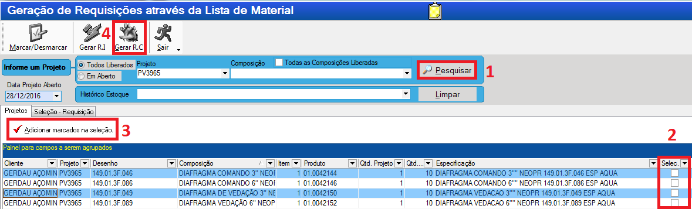

# Guia de operações PCP

Abaixo está uma estrutura de como é a sequência do fluxo de trabalho do PCP:

---
# 1. Egis

Nosso sistema para construção das árvores dos pedido e emissão de requisições.

>**Usuário:** Guilherme
>**Senha:** gro0924

## 1.1 Vendas
Assim que o comercial encaminha um pedido por e-mail, deve ser cadastrado no módulo de ***`Vendas internas`*** no EGIS para dar continuidade às operações.

### 1.1.1 Tipos de pedido
Existem 3 tipos de pedidos. Para saber diferenciar entre eles é necessário ter um pouco de experiência para saber o que é um equipamento e o que não é.

* **Pedidos de fabricação:**

* **Pedidos de sobressalentes:**
Pedidos que contém peças de itens que compõe os equipamentos.

* **Pedidos de reforma:**
Um de seus itens é um serviço de mão de obra.

### 1.1.2 Inserindo um pedido no EGIS
>Acesse o módulo de vendas
>
>

>Selecione a operação desejada no menu lateral:
>
>

>Assim que abrir o menu de pedidos clique em ***`Cliente`*** para inserir um novo pedido. 
>
>

>[!NOTE]
>
>Os Nº de pedido são gerados automaticamente em sequência, não é possível escolher eles. Se você estiver precisando cadastrar um pedido com um Nº que não é o maior imediato ao último cadastrado será necessário cadastrar pedidos com cliente e produto genérico para preencher o gap.
>
>Exemplo: O último PV cadastrado é o PV0001 e você quer cadastrar o PV0005, você terá que cadastrar antes todos os PVs até chegar no PV0005. Pode cadastrar como cliente aQuamec com os itens em branco e depois alterar o cliente e os itens.

>[!WARNING] 
>
>As vezes o EGIS pula um número de pedido. É uma falha sistêmica, quando isso acontecer não tem nada que possamos fazer. Continue cadastrando a partir do número que pulou.

>Na próxima tela clique em CNPJ para procurar o cliente e selecione o que mais parecer com o cliente do pedido.
>
>

>Se não tiver o cliente cadastrado clique em ***`inserir`*** no canto inferior esquerdo e preencha os dados do cliente no próximo formulário. Os campos mais importantes são os destacados em vermelho.
>
>
>
>

>Feito isso, um novo Nº de PV será gerado e você poderá inserir os itens do pedido.
>
>

>No final clique em gravar e saia do módulo!
>
>

### 1.1.3 Alterando um pedido
>Para alterar os itens de um pedido é só acessá-lo através de menu de pesquisa e alterar seus dados.
>
>

>Para alterar o cliente de um pedido será necessário acessar um menu diferente. Feche o módulo ***`Pedido de vendas`*** permanecendo apenas no módulo de ***`Vendas Internas`*** e selecione o módulo de alteração de cliente no menu esquerdo.
>
>

>Na próxima tela selecione o tipo ***`Pedido de Venda`*** insira o número do pedido e em ***`Cliente`*** clique nos 3 pontos para selecionar o cliente e siga os passos de inserir clientes explicado anteriormente no item ***1.1.2***
>
>

## 1.2 Engenharia

Todos os pedidos precisam ser engenheirados (ter desenho e lista de materiais) exceto itens padrões da lamor, tais como os abaixo:

Mas, **engenheirados ou não**, todos os itens precisam ter uma árvore no EGIS onde será feito requisição interna para retirá-los do estoque, ou de compra. Essa árvore deve ser aberta no módulo de engenharia após ter recebido os documentos da engenharia e cadastrado o pedido no módulo de vendas.

>Quando é um equipamento completo os documentos da engenharia, tais como as listas e desenhos, ficam salvos na rede ***Desenhos*** dentro da pasta ***PV_BOMBAS_E_VALVULAS*** ou dentro das pastas com o Nº do ano para os itens que são ***AQUAMEC***
>
>

>**Exemplo de lista da engenharia:**
>
>

>**Exemplo de desenho de montagem:** 
>
>São aqueles que possuem no uma lista na descrição
>
>

### 1.2.1 Explicando a interface

>**Acessar módulo de engenharia:**
>
> 
>
>

### 1.2.2 A-Colunas
Ao arrastar as colunas para cima ou para baixo você pode remover elas, ao clicar no botão  no menu inferior um menu lateral é aberto para você poder selecionar quais colunas quer ver.

### 1.2.3 A-Projetos
Na aba de projetos é possível ver itens dos pedidos que o comercial nos envia.

>[!NOTE]
>
>Item do peido = Projeto
>
>Cada item do pedido deve ser cadastrado como um projeto diferente, com o mesmo PV. Conforme visto na imagem do tópico [1.2.1-Explicando a interface](###1.2.1-Explicando-a-interface)

Para cadastrar um pedido você deve iniciar um projeto.

### 1.2.3.1 C-Cadastrar Projeto
Para cadastrar um projeto, você deve cadastrá-lo utilizando o menu . Os campos necessários para cadastrá-lo e o formato padrão para cadastro é:

>Assim que o inserir o ***`item`*** do ***`pedido de venda`*** e pressionar *tab* os dados do cliente e o ***`Nome do produto do cliente`*** serão preenchidos automaticamente com as informações cadastradas no módulo de vendas,conforme visto no tópico [1.1.2-Inserindo um pedido](###1.1.2-Inserindo-um-pedido). 

>[!IMPORTANT]
>
>Quando um Nº do pedido é pulado pelo sistema módulo de vendas no EGIS, não será possível preencher os dados automaticamente. Nesse caso preencha esse cadastro sem o Nº do ***`Item`***, para que não tente puxar os dados de maneira automática e insira o restante dos dados de forma manual conforme pedido enviado pelo comercial. E lembre-se de inserir a ***`Quantidade`***.

>Copie o ***`Nome do produto do cliente`*** e cole no ***`Nome interno`*** e no desenho insira o desenho do item, se não tiver também pode ser o nome do produto.

>Em ***`Projetista responsável`*** e ***`liberação`*** a única mudança que haverá em relação à da imagem é o nome do projetista que deverá ser *Josafá* para os itens da *Lamor* e *Rafael* para os demais.

>O ***`Centro de Custo`*** no rodapé também deve ser *`14 - (193) Produção Glass`* para itens de bombas, válvulas e suas partes. *`1 - Aquamec Equipamentos`* para itens da aquamec e *`27 - LAMOR AMBIENTAL`* para os itens da lamor.

### 1.2.4 B-Composições
Na aba de composições são subgrupos do projeto, geralmente divididos conforme os *desenhos* ou *listas* da engenharia.

### 1.2.4.1 C-Cadastrar Composição
Existem 2 formas de cadastrar uma composição, manualmente e por **Listas Standard**, manualmente será utilizado **somente** para itens que não forem de fabricação, mas sim de peças sobressalente, reformas, etc.

### 1.2.4.1.1 Manualmente

Forma de cadastro de composição utilizada **somente** para pedidos de sobressalentes

Para cadastrar uma composição, você deve estar dentro do projeto, para isso de 2 cliques na linha do projeto, ou selecionar o projeto e clique na aba ***`Composições`*** no campo **B**.

Os campos necessários de preenchimento são:

Onde ***`Item do Projeto`*** e ***`Tipo do Projeto`*** sempre deverão ser 1

O desenho deve ser sempre o Nº da lista da engenharia, que pode ser encontrado na capa da OP ou na própria lista:

### 1.2.4.1.1.1 Materiais
>Na interface de materiais é onde são cadastrados, de fato, todos os itens do projeto.
>
>

Para cadastrá-los, primeiro você deve estar dentro de uma composição. Para isso dê 2 cliques em uma composição, ou clique 1 vez e clique na aba de ***`Materiais`*** no campo **B**.

>Após isso clique no ícone de ***`Material`*** no campo **C** e um formulário se abrirá para você pesquisar o item do pedido. Clique no botão de inserir um novo pedido e logo após nos 3 pontos ao lado de **Fantasia Produto**
>
>

>Após isso um buscador se abrirá para você pesquisar o material. Pesquise pelo código ou pelo nome até achar o item desejado. Clique duas vezes sobre ele no botão ***Confirmar*** para adicioná-lo à lista de materiais do projeto.
>
>

Existem duas colunas de quantidade, onde numa é possível ver a quantidade inserida na lista e noutra é possível ver a quantidade total do projeto. 

>[!Note]
>
>Essa quantidade total é calculada multiplicando a quantidade que você inseriu durante essa fase de cadastro de materiais, a quantidade da composição e a quantidade do projeto, inseridos durante a inserção de seus respectivos cadastros.

Após concluir o preenchimento da lista de materiais clique no botão de salvar no canto inferior direito.

>[!TIP]
>
>Para pesquisar os itens utilize os caracteres **"%"**, por exemplo:
>
>`%bomba` trará os resultados que terminem com *bomba*.
>
>`bomba%` trará os resultados que comecem com *bomba*.
>
>`%bomba%` trará os resultados que contenham *bomba*.
>
>`%bomba%centrífuga%` trará os resultados que contenham *bomba* seguido de *centrífuga* com qualquer palavra no começo, no final e entre eles 

>[!TIP]
>
>As vezes você encontrará itens com descrições semelhantes ou em duplicidade. Para saber qual o mais correto a se usar organize a coluna *`disponibilidade`* do maior para o menor, o qua tiver maior número de movimentações é o mais correto.

>[!WARNING]
>
>Se não encontrar o produto específico deve ser solicitado o cadastro ao responsável por essa atividade.

### 1.2.4.1.2 Composição Standard

Outra forma de cadastrar uma composição é pelas listas Standard quando receber a lista, ou desenho da engenharia. 

Os desenhos de usinagem (exceto bases de bomba e protetores do acoplamento de bombas) e fundição não precisam ser cadastrados, porém os desenhos de montagem, também chamados de desenho de conjunto geral, precisam.

### 1.2.4.1.3 Cadastrando Listas Standards

>Acesse ***`listas standard`*** dentro do campo **C**
>
>

>No menu ***`Dados`*** clique em ***`Inserir`*** para adicionar uma nova composição
>
>

Na composição standard insira um código, pode ser qualquer um já que terá que mudar o descrição para o aquela que mais te servir.

>Cadastrar a composição no item assim como foi explicado na etapa *1.2.4.1.1* 
>

>Em seguida clique na aba ***`Material`*** para inserir os itens da composição. Essa aba contém duas abas de ***`dados`*** e ***`cadastro`***. Onde ***`cadastro`*** é o lugar que o item deve ser inserido e ***`dados`*** é onde são visualizados.
>
>

>Na aba de ***`cadastro`*** os campos necessários de preenchimento são os destacados na imagem abaixo. Sendo o tipo de produto e matéria prima os únicos constantes
>
>

>[!WARNING]
>
>Se não for inserido o Tipo ***`Produto`*** e a ***`Matéria Prima`*** dará um erro.

>Terminado de criar a composição, feche a janela. Escolha um projeto e dentro da aba  ***`Composições`*** no campo **B** clique em ***`Composição`*** no campo **C**.
>
>
>
>Selecione composição Standard no roda pé e na janela que abrir selecione todas as composições desejadas, conforme nº do ***`desenho`*** (que também pode ser a lista da engenharia) e clique em ok
>
>
>
>

>[!NOTE]
>
>Vamos revisar. No campo **B**:
>>Existe a aba de ***`projetos`***. Que são abertos conforme PV.
>>>Dentro do projeto existem ***`composições`***. Que são abertas conforme os desenhos, ou listas
>>>>Dentro das composições existem os ***`materiais`***. Que são abertos conforme os materiais dentro dos desenhos, ou listas.

### 1.2.5 Lista (Campo B)

Nessa aba é possível ver todos os itens que vão no pedido, mesmo que estejam em projetos diferentes, de forma resumida, ou seja, agrupados: Se tiver dois itens iguais dentro do mesmo projeto o item é mostrado apenas uma vez e a quantidade base(quantidade sem multiplicação) e somado, se tiver em projetos diferentes é mostrado uma vez para cada projeto.

E as quantidades não são multiplicadas.

>[!TIP]
>
>Se quiser ver o mesmo resumo, mas contendo uma coluna separando por composições. Acesse o menu de produtos explicado no tópico *1.2.8.*
>
>Se quiser copiar os dados, exporte para excel ou siga para a próximo tópico *1.2.6 Acompanhamento*
>
>

### 1.2.6 Produtos (Campo B)

Faz a mesma função da lista, porém separa os itens de **1 projeto** por composição e não de vários projetos. E mesmo se tiver mais de 1 item idêntico na composição, não é agrupado.

Nessa aba é possível dar 2 cliques para selecionar e copiar os valores de dentro das células.

### 1.2.7 Verificação de estoque.

Após ter inserido o projeto, as composições e os itens das composições, o próximo passo é enviar para o almoxarifado verificar e separar o estoque.

Para isso, monte um email conforme imagem abaixo. Encaminhando junto os documentos enviados pela engenharia.

O almoxarifado responderá com a seguinte lista. Indicando o que tem e o que não tem em estoque:

Para os itens que foram marcados que temos disponível, faça uma requisição interna. (Continue a partir do passo 10-Plano de corte)

Para os itens que não temos disponível existem duas rotas a se tomar:

* Para o itens comerciais e fundidos faça uma requisição de compra.

* Para os itens usinados, imprima o desenho de usinagem, leve até o responsável pelo setor de usinagem (Atualmente é o Sr. Cristiano Sebastião), ele lhe dirá o que ele conseguirá fazer internamente e o que será necessário fazer uma requisição de compra do serviço de usinagem.

    Se ele for fazer internamente, faça uma requisição interna da usinagem. Se for externo existem duas rotas:

    * Verifique se o item é usinado a partir de fundido ou matéria prima. Na lista da engenharia está indicando isso.

    >
    >
    >Os itens acima são usinados a partir de fundidos. Os códigos dos desenhos dos fundidos começam com o número 1 e 2 para os usinados. Além disso, na descrição é possível observar que esses desenhos estão ligados com apenas um item.

    >
    >
    >Os itens acima são usinados a partir de matéria prima. Na descrição é possível observar que existem mais de um item e abaixo está descrito a matéria prima que será usinada para virar o item acima.

    * Para os itens usinados a partir de fundidos: Faça uma requisição de compra normalmente. Se já tivermos os fundidos em estoque, solicite a separação e a *liberação da Nota Fiscal de envio de remessa para industrialização*. Se não tiver em estoque, requisite a compra e aguarde o recebimento deles para depois solicitar.

    * Para os itens usinados a partir de matéria prima: Verifique se ele é comprado já com a matéria prima. Se for, é necessário fazer apenas a solicitação de compra. Se não for, faça um `Plano de Corte` e entregue ao responsável pelo setor de caldeiraria/fabricação (atualmente o Sr. Wellington Pereira).

### 1.2.8 Liberação (Campo C)

Após as árvores terem sido feitas. Tire um print do projeto e envie para o almoxarifado verificar os itens que temos disponíveis em estoque.

Alguns códigos, naturalmente, estarão errados e o almoxarifado corrigirá. Corrija esses códigos dentro das listas standard e nos itens dentro de cada composição.

>[!WARNING]
>
>Para fazer requisições é necessário que os projetos estejam liberados. Certifique de fazer uma liberação a cada mudança dentro das árvores, se não as requisições não sairão conforme a última alteração.

Selecione o ícone de liberação no menu **C** . Existem duas forma de fazer a liberação

* **Liberar Projeto:** Você não precisa selecionar quais itens quer liberar, pois ela libera tudo que está dentro do projeto de uma vez só. Porém, é mais restritiva, pois ela só libera **1 projeto por vez**. 

    Se o **pedido** tiver vários itens e, por consequência, a árvore tiver vários **projetos**, você terá que sair da tela de liberação após liberar um projeto, entrar em outro projeto, acessar essa tela de liberação e liberar projeto.

    Portanto é melhor usá-la quando o pedido tiver apenas 1 item.

* **Liberar Seleção:** Você consegue liberar todos os projetos e seus itens de uma vez. Porém só funciona uma vez. Se todos os projetos do pedido já tiverem liberados, não será possível utilizar essa função, apenas a liberação de projeto.

    Portanto só a utilize **após** o almoxarifado ter respondido e todas as alterações terem sido feitas nos itens das composições dos projetos.

### 1.2.9 Requisição (Campo C)

Tendo corrigido e liberado a árvore do pedido e alinhado com os coordenadores o que será feito internamente e externamente, é hora de fazer as requisições.

>No campo **C** clique em geração de requisição
>
>

>Na próxima janela que se abrirá, siga a rota abaixo:
>
>
>
>**1.** Clique em pesquisar para buscar os itens do da árvore do pedido. Aqui ele busca os itens de todos os projetos que contenham o título (que inicia com "PV...") semelhante.
>
>**2.** Selecione todos os itens que deseja requisitar.
>
>**3.** Clique para adicionar os itens selecionados na requisição
>
>**4.** E por fim gere a requisição desejada.

Ao clicar em `Gerar RI` ou `Gerar RC` abrirá uma janela de confirmação. 

>Para a requisição interna apenas confirme.
>
>

>Para requisição de compra, certifique de ter selecionado o `centro de custo` correspondente ao Pedido, conforme visto no tópico [1.2.3.1-Cadastrar Projeto (Campo C)](###1.2.3.1-C-Cadastrar-Projeto) e o `plano de compras` sempre será `01.15`
>
>

>[!IMPORTANT]
>
>**Sempre** separe as requisições de compra por tipo de produto. Para os itens que são comerciais gere numa requisição de compra para eles, para os fundidos gere outra, para os usinados outra, para os itens de corte à laser outra e para os serviços outra. Conforme mostrado no e-mail abaixo:
>
>Envie o e-mail para o setor de compras e copie seu superior imediato. O gerente da fábrica e o **Coordenador interno** (não o comercial) do pedido.
>
>Encaminhe junto os documentos da engenharia. E lembre de mudar o título.
>
>

Caso seja uma requisição interna, basta responder o e-mail do almoxarifado com a requisição. 

>[!HINT]
>
>Também é interessante separar as requisições internas pelo que será usinado/fabricado internamente e pelo que já temos pronto no almoxarifado. Isso facilitará na hora de inserir essas informações no Hailer.
>
>

# 2.SADI

Sistema por onde suprimentos (compras) controla os pedidos de compra.

Para acessá-lo entre no site:

[https://e-lever.com.br/alpina/consultaDinamica/application/views/Consulta%20Dinamica.php](https://e-lever.com.br/alpina/consultaDinamica/application/views/Consulta%20Dinamica.php)

>**Login:** nilton2  
>**Senha:** Nlt@2018
>
>Acesse o seguinte caminho. É normal que demore um pouco para carregar.
>
>

## Importando pedidos do EGIS para o SADI

## Exportando pedidos do SADI para o Hailer

## 3.

# 3.Hailer
Nosso software para gerenciar os processos dos pedidos.

>**Login:** seu email
>
>**Senha:** mesma senha que usa para entrar no computador

## 3.1Módulos
### 3.1.1 PCP em carga
Onde fica todos os PV's desde a abertura até expedição. Nos ajuda a ver em qual fase (Área) do processo o pedido está e qual ação está aguardando.

# 3.2 Como inserir dados no Hailer
Existem duas formas de inserir dados no Hailer:
# 3.2.1 Manual
Clique em  e abrirá um menu lateral para você inserir os dados

A ***Data Cronograma*** será preenchida posteriormente somente pelo supervisor do PCP após ter elaborado o cronograma do pedido.

Na ***Área responsável e Ação*** são inseridos qual etapa do processo se encontra o pedido. Se for um pedido de bombas e válvulas, **sempre** precisará de desenho da engenharia para poder dar continuidade, então a Área responsável será preenchida com *ENGENHARIA* e a ação com *AGUARDANDO DESENHOS*

Para pedidos padrões da Lamor cujo não é necessária a etapa de engenharia, conforme imagem vista no tópico 1.2, será aberto já como *ALMOXARIFADO* e *VERIFICANDO ESTOQUE*.

Nas ***Observações*** deverá ser inserido o tipo de frete para o pedido e a transportadora. Essas informações são encontradas no pedido. Se o frete for *FOB* e não tiver transportadora insira como *FRETE: FOB - CLIENTE IRÁ DEFINIR*, caso seja *CIF* e não tiver a transportadora apenas insira *FRETE: CIF*, caso contrário, insira o tipo de frete e o nome da transportadora.

***Coordenadores***
> Os coordenadores do módulo PPCP e dos outros são diferentes vide tabela abaixo

|Setores|PPCP|Outros|
|:-------|:----|:------|
|Aquamec|Lucas Azevedo|Se ÁREA = montagem, então é Jean, se ÁREA = Fabricação, então é Wellington|
|Bombas/Válvulas|Lucas Azevedo|Cristiano Sebastião|
|Lamor|Hilton Júnior|Jean Leme|

# 32.2.2 Importando dados
Muito útil para pedidos grandes.
Selecione os seguintes botões

Uma planilha, contendo em seu nome a palavra "template", será gerada. Ali você deve preencher com os dados que quer inserir no módulo do Hailer, aqui está um modelo.

>[!WARNING]
>
>Por se tratar de um sistema holandês, nos campos de **data** o único formato aceito pelo Hailer é **"AAAA.MM.DD"**.
>E todos os campos, exceto *valor com impostos* deve ser do tipo texto. Por isso insira o código do pedido com uma aspas simples, se não o excel converterá o código em número.

> [!IMPORTANT]
>
> Quando haver um pedido grande (com várias linhas) é importante adicionar o valor do IPI em cima do preço total de cada item, para o valor final bater com o valor total do pedido. Para esse processo fica mais fácil importar os dados através do excel.

>[!Tip]
>
>Não é necessário ter todos os campos preenchidos para poder fazer o upload no hailer e nem todos os campos serão upados mesmo se preenchidos, por exemplo: se existir mais de um cliente cadastrado com o mesmo nome (duplicidade), ou se estiver com o nome errado, o sistema irá upar o campo como vazio. Posteriormente ao upload esses dados poderão ser inseridos em conjunto conforme mostrado na seção 2.2.

### 3.1.2 PCP concluído
Onde fica todos os PV's que já foram atendidos (expedidos)

### 3.1.3 Follow Up pendentes
Onde fica os itens que controlamos e está pendente de recebimento.

As informações contidas nesse módulo vem do sistema Sadi (compras)

### 3.1.4 Follow Up recebidos

### 3.1.5 Ordem de produção em carga
Onde ficam todos os pedidos que estão em produção atualmente.

### 3.1.6 Ordem de produção finalizado
Onde ficam todos os pedidos que estavam em produção e foram finalizados.

---
# 4.2 Como editar dados no Hailer

---

## Planilha de Análise Hailer
## Rotinas
## Solicitação Costumar (Dona Maria)
## Horas funcionários
### Planilha de Análise Horas Funcionários
## Plano de corte

Tendo terminado de:

1. Abrir o PV no EGIS - [1.1.2](1.1.2)

2. Realizar a árvore do projeto para o PV. [1.2.3.1](1.2.3.1)

3. Verificado o estoque. [1.2.7](1.2.7)

4. Corrigido o código dos itens nas composições do projeto e standard conforme informado pelo almoxarifado

5. Alinhado o que usinaremos / fabricaremos internamente ou não com os coordenadores

6. Feito as requisições [1.2.9](1.2.9)

# 3 Lista de Aprovisionamento 
# 2. Sadi
## Solicitação NF de remessa para industrialização
